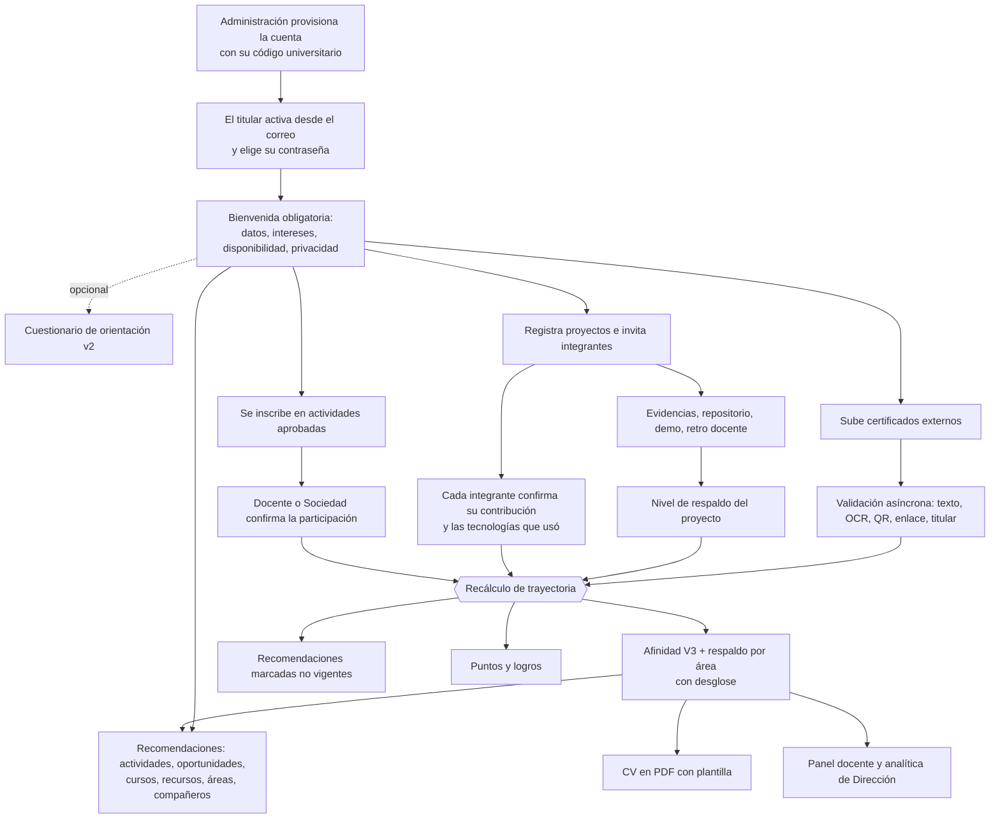
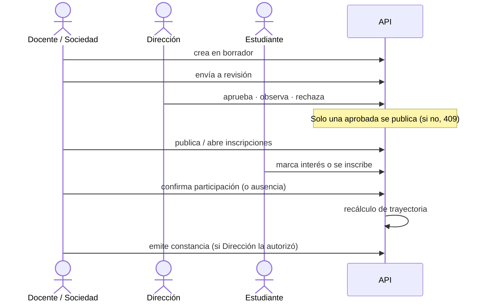
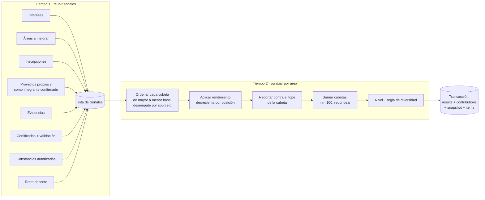
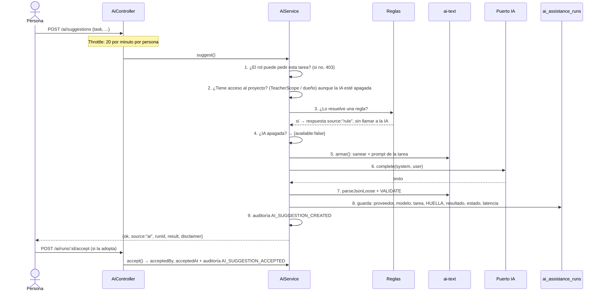

# Afinia · Flujo completo del sistema y los motores de afinidad e IA

**Sistema Multiplataforma para la Construcción del Perfil Estudiantil Dinámico
en Ingeniería en Sistemas Informáticos** · Universidad Privada del Valle

Este documento cuenta **de punta a punta** qué hace Afinia hoy (rama
`feat/afinia-v2`, Especificación Maestra Final V2, BATCH 0 a 17) y se detiene
en las dos piezas que más preguntas despiertan: **el motor de afinidad V3** y
**el asistente de IA**. No se queda en «qué hacen»: explica **cómo están
construidos**, con qué reglas, en qué orden y por qué así.

Cada cifra y cada regla de este texto sale del código. Al final de cada
sección está el archivo exacto donde vive, para que cualquier afirmación se
pueda comprobar.

> Para una visión general más corta, ver [`EL_SISTEMA_COMPLETO.md`](EL_SISTEMA_COMPLETO.md).
> Para la trazabilidad de requisitos, [`MATRIZ_TRAZABILIDAD_V2.md`](MATRIZ_TRAZABILIDAD_V2.md).

---

## Índice

1. [La idea en una página](#1-la-idea-en-una-página)
2. [Arquitectura](#2-arquitectura)
3. [El flujo completo, paso a paso](#3-el-flujo-completo-paso-a-paso)
4. [Cómo llega una señal al motor: el recálculo de trayectoria](#4-cómo-llega-una-señal-al-motor-el-recálculo-de-trayectoria)
5. [El motor de afinidad V3, en detalle](#5-el-motor-de-afinidad-v3-en-detalle)
6. [Las fuentes de respaldo: proyectos y documentos](#6-las-fuentes-de-respaldo-proyectos-y-documentos)
7. [El motor de recomendaciones](#7-el-motor-de-recomendaciones)
8. [El asistente de IA, en detalle](#8-el-asistente-de-ia-en-detalle)
9. [Seguridad que atraviesa todo](#9-seguridad-que-atraviesa-todo)
10. [Los clientes: web y móvil, y la navegación sin parpadeo](#10-los-clientes-web-y-móvil-y-la-navegación-sin-parpadeo)
11. [Cómo se prueba cada pieza](#11-cómo-se-prueba-cada-pieza)
12. [Decisiones de diseño, resumidas](#12-decisiones-de-diseño-resumidas)

---

## 1. La idea en una página

Afinia responde a una pregunta: **¿con qué áreas de la carrera se relaciona la
trayectoria de un estudiante, y cuánto de eso está demostrado?**

```
 LO QUE DECLARA                      LO QUE HIZO Y ESTÁ RESPALDADO
 (intereses, tecnologías a           (participación confirmada, proyectos
  mejorar, orientación)               con respaldo, certificados validados)
        │                                         │
        │ orienta                                 │ construye
        ▼                                         ▼
 ┌───────────────────┐   usa (10 %)    ┌──────────────────────────┐
 │  RECOMENDACIONES  │ ◄────────────── │  AFINIDAD V3 + RESPALDO  │
 │  qué hacer luego  │                 │  por área, de 0 a 100    │
 └───────────────────┘                 └──────────────────────────┘
        ▲                                         │
        │ sugiere, nunca decide                   ▼
 ┌───────────────────┐                 ┌──────────────────────────┐
 │  ASISTENTE DE IA  │                 │  CV, panel docente,      │
 │  (opcional)       │                 │  analítica de Dirección  │
 └───────────────────┘                 └──────────────────────────┘
```

Tres principios atraviesan todo el sistema:

1. **Declarar no es demostrar.** Los intereses orientan las recomendaciones,
   pero **no suman afinidad**. Solo suma lo que otra persona confirmó o el
   sistema pudo comprobar.
2. **Todo número se explica.** Cada punto de afinidad tiene una línea en un
   desglose que dice de dónde salió, cuánto valía, qué multiplicador recibió y
   si chocó con un tope. También se lista lo que **no** sumó y por qué.
3. **La IA sugiere, la persona decide y las reglas mandan.** El asistente nunca
   escribe afinidad, respaldo, aprobaciones, participación ni constancias.

---

## 2. Arquitectura

Un monolito modular con una sola API y dos clientes.

```
afinia/
├── shared/   Tipos, enums y ESCALAS del motor (las mismas cifras en API, web y móvil)
├── api/      NestJS 10 + TypeORM 0.3 + PostgreSQL 16   → :3010/api
├── web/      React 18 + Vite + framer-motion            → :5173 (cinco roles)
├── mobile/   React Native 0.81 + Expo SDK 54            → solo Estudiante
├── scripts/  Suites e2e, Playwright, k6, ZAP
└── docs/
```

| Pieza | Cifra |
|---|---|
| Tablas | 68 |
| Migraciones (todas con `up` y `down`, `synchronize: false`) | 36 |
| Rutas HTTP | 228, en 28 controladores |
| Pantallas | 42 web, 15 móvil |

**Puertos y adaptadores** donde algo puede cambiar sin tocar el resto:

| Puerto | Adaptadores | Para qué |
|---|---|---|
| `TrajectoryRecalculationPort` | `TrajectoryRecalculationService` | Un solo punto que recalcula afinidad → recomendaciones → puntos |
| `AiAssistancePort` | `NoneAiAdapter`, `OpenAiCompatibleAdapter` | El asistente de IA, intercambiable por configuración |
| Almacenamiento | local privado | Archivos de evidencias y certificados |
| OCR | puerto propio | Extracción de texto en la validación |

**Colas persistentes en la base** (no en memoria): correo (`mail_jobs`) y
validación de documentos (`validation_records`). Un reinicio no pierde trabajo;
un trabajo «huérfano» en `PROCESSING` vuelve a la cola.

---

## 3. El flujo completo, paso a paso

### 3.1 Vista de pájaro



### 3.2 Alta y acceso

- **No hay registro público.** Administración crea la cuenta (`POST /users`) o
  importa el padrón.
- **Toda cuenta tiene código universitario**, único, con el formato
  `PREFIJO-XXXXXXX` (siete letras o números en mayúscula). Lo escribe quien
  crea la cuenta, o llega en el padrón; el servidor rechaza el que no tenga el
  prefijo del rol:

  | Rol | Prefijo | Semestre al crear |
  |---|---|---|
  | Estudiante | `EST-` | Obligatorio |
  | Sociedad científica | `EST-` | Obligatorio |
  | Docente | `DOC-` | — |
  | Dirección de carrera | `DIR-` | — |
  | Administración | `ADM-` | — |

  El código y el semestre viven en la cuenta (`users`); el perfil del
  estudiante guarda una copia sincronizada. La contraseña no puede contener el
  código, en ninguna cuenta.
- La activación sale por la **cola de correo** con enlace y código (vigencia
  48 h). El reenvío tiene espera de 120 s y tope diario.
- La contraseña sigue una sola política en servidor y pantallas: 12 a 128
  caracteres, cuatro clases, sin el correo ni el código.
- `POST /auth/login` devuelve un **access token corto** y un **refresh
  rotatorio** (cookie HttpOnly en la web). Cerrar sesión revoca el refresh en
  el servidor.
- **Recargar la página no cierra la sesión.** El access token vive en memoria,
  así que tras un F5 la web lo renueva con la cookie. Si el F5 cae justo en
  medio de una renovación, el servidor ya rotó el token pero el navegador
  descarta la cookie nueva. Por eso el token recién reemplazado sirve **una
  vez más** durante 60 s (`REFRESH_TOKEN_REUSE_GRACE_SECONDS`); usado de nuevo,
  responde 401. En el cliente hay una sola renovación en vuelo, compartida por
  toda la página y coordinada entre pestañas (Web Locks), y solo un 401 real
  cierra la sesión: un corte de red o un 429 no. `/auth/refresh` tiene su
  propio límite (60 por minuto); el del login sigue en 10.
- La app móvil **solo emite sesión a estudiantes**. Otro rol recibe un rechazo
  desde la API, no solo desde la pantalla.

### 3.3 La bienvenida (onboarding)

Cuatro pasos obligatorios que **el servidor exige**: el cliente no puede
saltárselos.

1. Confirmar los datos institucionales.
2. Declarar al menos un **interés por tecnología** o una tecnología a mejorar
   (`student_skill_interests`, tipo `interest` o `improve`).
3. Decidir la **disponibilidad** (`open`, etc.).
4. Revisar la **privacidad**: si otros pueden encontrarlo (`peerDiscoverable`)
   y si su perfil público está activo.

El **cuestionario de orientación** es opcional. Va en su versión 2: se adapta a
las áreas que el estudiante ya declaró con preguntas de profundización y acepta
respuestas parciales a partir de 6. Las preguntas viven versionadas en código
(`QUESTIONNAIRE_VERSION = 2`). Lo que se persiste es la ejecución, las
respuestas literales y las áreas que salieron, así que un resultado viejo se
sigue leyendo con su versión. Las áreas que el estudiante **confirma** de su
orientación pesan un 20 % en las recomendaciones, y **nada** en la afinidad.

> Ya no se declara nivel de habilidad («básico/intermedio/avanzado»). La V2 lo
> retiró: la ruta responde 410 y la tabla `student_skills` queda como historia.

### 3.4 Actividades: de la propuesta a la constancia



Cada estado de la inscripción tiene un significado distinto para el motor:

| Estado | ¿Suma afinidad? | Por qué |
|---|---|---|
| `interested` | No | Marcar interés es una intención, no una experiencia |
| `registered` | No | Inscribirse tampoco es haber participado |
| `confirmed` | **Sí, 10 puntos base** | Un tercero (el responsable) confirmó que participó |
| `absent` | No (no se registra) | — |

El **semestre** de la actividad (`semesterScope`) es un filtro duro: un
estudiante no recibe recomendaciones de actividades dirigidas a otro semestre.

### 3.5 Proyectos

- El responsable es **integrante desde el inicio**.
- Los demás entran por **invitación** y, una vez dentro, cada uno **confirma su
  contribución** y **las tecnologías que usó** (`project_member_skills`, el
  `skills_used` de la especificación).
- Mientras un integrante no confirme su contribución, el proyecto **no cuenta**
  para él. Lo que figura ahí lo escribió otra persona.
- El proyecto tiene un **nivel de respaldo** derivado automáticamente (ver
  §6.1). Cambiarlo recalcula la afinidad de **todo el equipo**.

### 3.6 Evidencias, certificados y validación

Los archivos se guardan privados y se descargan solo con sesión y permiso. Al
subir un certificado o una evidencia se encola una **validación asíncrona**
(ver §6.2). Afinia nunca afirma autenticidad legal: dice qué pudo comprobar.

### 3.7 Afinidad, recomendaciones y CV

Cualquier cambio relevante dispara el recálculo (§4). El estudiante ve:

- **Afinidad** por área de 0 a 100, con su nivel y su **desglose** línea por
  línea.
- **Respaldo** por área de 0 a 100, con su nivel y las familias de prueba que
  lo sostienen.
- **Historial** de cálculos (hasta 30 instantáneas de la versión vigente; las
  de versiones anteriores se conservan siempre).
- **Recomendaciones** agrupadas, cada una con sus motivos y su puntaje.
- **CV en PDF** con plantilla. Un texto redactado con IA entra solo si el
  estudiante aceptó esa sugerencia (§8.9).

### 3.8 Colaboración sin chat

- Perfil compartible opcional, con enlace opaco que se puede regenerar y un QR
  que solo lleva ese enlace.
- Contactos por **solicitud aceptada**. **No hay chat**: cada uno comparte, si
  quiere, sus canales (Teams, WhatsApp, LinkedIn, correo de contacto u otro
  enlace).
- **Equipos** que nacen de una necesidad declarada. El sistema sugiere
  candidatos complementarios; **invitar es siempre una decisión humana**. Los
  nombres de equipo pasan por **reglas** y, si hay IA, por una **segunda
  barrera** de moderación (§8.8).

### 3.9 Docentes, Dirección, Sociedad científica, Administración

| Rol | Qué ve del flujo |
|---|---|
| Docente | Estudiantes y proyectos **de sus semestres habilitados**, su Panel académico por semestre, necesidades de equipo de su alcance |
| Dirección | Aprobación de actividades, autorización de constancias y **analítica agregada** con umbral de grupo mínimo |
| Sociedad científica | Sus actividades y sus métricas, nada más |
| Administración | Cuentas, padrón, alcance docente, catálogos (áreas, tecnologías con alias, categorías, recursos), criterios de puntos, auditoría |

---

## 4. Cómo llega una señal al motor: el recálculo de trayectoria

Todo lo que cambia la trayectoria pasa por **un único coordinador**:

```
TrajectoryRecalculationService.requestRecalculation(studentProfileId, signal)
   1. AffinityEngineService.recalculate(id)     ← si falla, falla todo
   2. recommendations: isCurrent = false        ← barato; se regeneran al consultar
   3. gamificación                              ← un fallo no deshace lo anterior
```

**¿Por qué en ese orden?** Recomendar con la afinidad vieja produciría consejos
que contradicen lo que el estudiante acaba de hacer. Por eso la afinidad va
primero y es la única que puede abortar el proceso.

**¿Por qué las recomendaciones se invalidan y no se regeneran ahí mismo?**
Regenerarlas obligaría a recorrer todo el catálogo de actividades y recursos
dentro de la transacción de quien subió un certificado. Se marcan como no
vigentes y **la próxima consulta las recalcula** con datos frescos. Lo que el
estudiante decidió (guardar o descartar) no se toca.

### 4.1 Quién dispara el recálculo

| Origen | Archivo |
|---|---|
| Participación confirmada / cambio de inscripción | `activities/activities.service.ts` |
| Certificado creado, editado, eliminado o validado | `certificates/certificates.service.ts` |
| Constancia emitida | `constancies/constancies.service.ts` |
| Evidencia subida o eliminada | `evidences/evidences.service.ts` |
| Cambios del perfil | `profiles/profiles.service.ts` |
| Proyecto creado o editado, integrante que confirma tecnologías | `projects/projects.service.ts`, `project-members.service.ts` |
| **Cambio del nivel de respaldo de un proyecto** → a **todos** sus integrantes | `projects/project-backing.service.ts` |
| Retroalimentación docente → recalcula el respaldo del proyecto → cascada | `project-feedback/project-feedback.service.ts` |
| Arranque de la API: perfiles con versión de motor anterior | `affinity-recalc/affinity-backfill.service.ts` |
| Manual: `POST /affinity/recalculate/me`, `/recalculate/:studentId`, `/recalculate-all` | `affinity-recalc/affinity.controller.ts` |

---

## 5. El motor de afinidad V3, en detalle

> **Archivos:** reglas en `shared/src/enums/affinity-engine.ts`; motor en
> `api/src/affinity-recalc/affinity.engine.ts` (1 400 líneas); migración de
> resultados en `affinity-backfill.service.ts`.

### 5.1 Qué pregunta responde

La V1 y la V2 respondían «¿hacia dónde se inclina el estudiante?» y mezclaban
lo declarado con lo hecho. **La V3 cambia la pregunta**: *¿qué tan relacionada
está su trayectoria RESPALDADA con esta área?*

De ahí sale la decisión más importante del motor: **lo declarado vale 0**.
Intereses, áreas a mejorar, orientación, disponibilidad y tecnologías de
interés **se registran** en el desglose (para poder explicar que se tuvieron en
cuenta), pero no suman un solo punto. Alimentan las recomendaciones.

### 5.2 Propiedades garantizadas

| Propiedad | Cómo se garantiza |
|---|---|
| **Determinista** | Sin aprendizaje automático ni azar. Las señales se ordenan por puntos y se desempatan por `sourceId`: los mismos datos dan siempre el mismo número |
| **Absoluto** | El puntaje no se divide por el área más fuerte del propio estudiante. Un 40 hoy y un 40 el año que viene significan lo mismo |
| **Acotado** | Cada familia tiene tope y el total nunca pasa de 100 |
| **Explicable** | Cada señal se guarda en `affinity_contributions` con su motivo, su base, su multiplicador y sus puntos finales |
| **Versionado** | `engine_version = 3` en cada resultado e instantánea, más una huella (`rules_version`) de pesos y estructura |
| **Atómico** | Borrar e insertar ocurren en una transacción con cerrojo por perfil |

### 5.3 Las dos mitades de la regla: pesos y estructura

La especificación permitía guardar los pesos en la base o centralizarlos en el
motor. Se hacen las dos cosas, cada una donde sirve:

- **Los puntos base** de cada señal viven en la tabla `affinity_weights`. Son
  lo único que Dirección podría querer ajustar, y ahí quedan registrados y
  auditables sin redesplegar. Si una fila falta, el motor usa
  `DEFAULT_WEIGHTS` (los mismos valores de `AFFINITY_POINTS_V3`): es preferible
  calcular con el valor conocido que devolver una afinidad incompleta sin avisar.
- **La estructura** (topes, rendimientos decrecientes, niveles, máximo) vive en
  código, en `shared`. No es un parámetro: cambiarla cambia lo que significa
  el número, y eso debe pasar por una **versión del motor**, no por un UPDATE.

Vivir en `shared` tiene una segunda razón: la pantalla de afinidad muestra
exactamente esas cifras **sin volver a escribirlas**. El estudiante ve la misma
regla con la que se le calculó.

### 5.4 Las cifras

**Afinidad (puntos base por señal):**

| Familia | Señal | Puntos base | Rendimiento decreciente | Tope por área |
|---|---|---|---|---|
| Actividad | participación **confirmada** | 10 | 1 · 0,7 · 0,5 · 0,3 | **25** |
| Proyecto | según nivel de respaldo: declarado / respaldado / corroborado / revisado / marcado | 0 / 10 / 18 / 22 / 0 | 1 · 0,75 · 0,5 · 0,25 | **50** |
| Certificado | según respaldo: declarado / respaldado / corroborado | 0 / 8 / 15 | 1 · 0,75 · 0,5 · 0,25 | **25** |
| Declarado | intereses, áreas a mejorar, orientación | **0** | — | 0 |
| Evidencia, constancia | — | **0** (mejoran el *respaldo*, no crean afinidad) | — | — |

```
AFFINITY_SCORE(área) = round( min(100, actividades + proyectos + certificados) )
                                      ≤25          ≤50          ≤25
```

**Respaldo (otra escala, otra pregunta: «cuánto de esto está demostrado»):**

| Familia | Puntos por señal | Rendimiento decreciente | Tope |
|---|---|---|---|
| Actividad confirmada | 8 | sí (1 · 0,7 · 0,5 · 0,3) | **20** |
| Constancia que refuerza una participación ya contada | 4 (misma cubeta que actividades) | sí | (dentro de los 20) |
| Proyecto según nivel | 0 / 8 / 15 / 20 / 0 | sí (1 · 0,75 · 0,5 · 0,25) | **45** |
| Certificado según nivel | 0 / 8 / 15 | **no** (la especificación no lo pide) | **25** |
| Otros: revisión docente no contada (5), evidencia de actividad corroborada (3), constancia suelta (4) | — | no | **10** |

Los cuatro topes de respaldo suman exactamente 100.

**Niveles** (iguales para afinidad y respaldo, porque ambos viven en 0–100):

| Nivel | Rango |
|---|---|
| Bajo | 0 – 24 |
| Medio | 25 – 59 |
| Alto | 60 – 100 |

**Regla de diversidad del respaldo:** un respaldo ≥ 60 sostenido por **una sola
familia independiente** se queda en **Medio**. Las familias independientes son
`activity`, `project`, `external_certificate` y `academic_review`. Lo declarado
y «otros» no cuentan: lo que uno dice de sí mismo no respalda nada. La
diversidad cuenta **señales, no puntos**: una señal cuenta aunque su cubeta ya
estuviera llena. Lo contrario sería perverso, porque la cuarta actividad haría
desaparecer una familia.

### 5.5 El algoritmo, en dos tiempos

El motor **primero reúne todo lo que podría puntuar y después puntúa**. No es
cosmético: los rendimientos decrecientes dependen de cuántas señales hay en el
área y en qué orden quedan, y los topes dependen del total. Ninguna de las dos
cosas se puede decidir mirando una señal aislada.



Cada **Señal** lleva: área, familia, tipo, código de peso, tipo de coincidencia
(declarada, heredada, por etiqueta o por texto), entidad de origen e id, puntos
base de afinidad, puntos base de respaldo, cubeta de afinidad, cubeta de
respaldo, escala de rendimiento y **motivo legible**.

#### Tiempo 1 · de dónde sale cada señal

1. **Intereses** (`student_interests`): una señal por interés con base 0 y el
   motivo *«orienta tus recomendaciones, pero no suma afinidad»*.
2. **Áreas a mejorar** (`improvementAreaIds`): igual, base 0.
3. **Inscripciones**: las no confirmadas se registran con 0 y su motivo. Las
   confirmadas generan una señal de actividad (10 de afinidad, 8 de respaldo)
   y anotan el área en `areasConParticipacion`, que después usan las
   constancias.
4. **Proyectos**: los propios y aquellos donde el estudiante es integrante
   **con la contribución confirmada**. Para cada uno:
   - **Áreas = las de las tecnologías que ESE integrante confirmó haber usado.**
     Ni las tecnologías generales del proyecto ni su área principal le
     atribuyen experiencia a nadie. Si confirmó tecnologías de dos áreas, el
     proyecto genera una señal **en cada una**.
   - Puntos según el nivel de respaldo del proyecto (§6.1).
   - **Sin tecnologías confirmadas:** afinidad 0, pero el **respaldo** del
     proyecto sigue contando en su área principal (o en la que se infiera de
     sus tecnologías por etiquetas). La trayectoria existe aunque falte decir
     con qué se hizo, y el desglose le pide al estudiante que lo confirme.
5. **Evidencias**: no crean un proyecto más. Se registran con 0. Una
   **evidencia de actividad** ya validada (respaldada o corroborada) aporta
   3 puntos de respaldo en «otros», porque es trazabilidad que no está contada
   en otro sitio. La de proyecto no, porque ya subió el nivel del proyecto.
6. **Certificados**: su nivel sale de la validación (§6.2). Un **duplicado**
   (mismo contenido ya validado) se degrada a declarado y lo dice en el motivo:
   no vuelve a respaldar. El área es la declarada o, si no la hay, la que
   coincida por texto con el nombre o el emisor.
7. **Constancias autorizadas**: base 0 de afinidad. Si el área tiene una
   participación confirmada, aportan 4 de respaldo **en la cubeta de
   actividades** (refuerzan el mismo evento, no crean otro). Si no, son una
   señal suelta y caen en «otros».
8. **Retroalimentación docente**: si el proyecto ya es `REVIEWED`, esa
   revisión ya está contada en los puntos del proyecto y aquí vale 0, porque
   sumarla otra vez sería contar la misma realidad dos veces. Si no, aporta 5
   de respaldo en «otros».

#### Tiempo 2 · cómo se puntúa (`puntuar`)

Para cada área, y para cada cubeta (`activity`, `project`, `certificate`):

```
propias = señales de la cubeta, ordenadas por base DESC, desempate sourceId ASC
acumulado = 0
para cada señal en posición i:
    factor  = escala[min(i, len-1)]             # 1, 0.7, 0.5, 0.3, 0.3, ...
    bruto   = redondear2(base × factor)
    espacio = max(0, TOPE_cubeta − acumulado)
    puntos  = min(bruto, espacio)               # si recorta: «tope del área alcanzado»
    acumulado += puntos
raw = min(100, Σ cubetas)
score = round(raw)
```

El **orden** importa y está fijado: el multiplicador del 100 % le toca siempre
a la señal **más fuerte**. Si dependiera del orden en que salen las filas de la
base, dos estudiantes con los mismos datos podrían obtener números distintos.

El respaldo recorre las cuatro cubetas con la misma función (si fueran dos
funciones, tarde o temprano divergirían), pero aplica rendimiento decreciente
solo donde la especificación lo pide: actividades y proyectos.

Los redondeos intermedios son a **dos decimales** (para que `0.1 + 0.2` no
produzca puntajes raros). El final es entero.

### 5.6 Un ejemplo completo, número por número

Ana, área **Desarrollo Web**:

- 5 actividades confirmadas.
- Proyecto A, `REVIEWED`, donde confirmó React y NestJS.
- Proyecto B, `CORROBORATED`, donde confirmó Vue.
- 1 certificado `SUPPORTED`.
- 1 constancia autorizada de una de esas actividades.
- Marcó Desarrollo Web como interés con prioridad 1.

**Afinidad:**

| Señal (orden) | Base | Factor | Bruto | Espacio | Puntos |
|---|---|---|---|---|---|
| Actividad 1 | 10 | 1 | 10 | 25 | 10 |
| Actividad 2 | 10 | 0,7 | 7 | 15 | 7 |
| Actividad 3 | 10 | 0,5 | 5 | 8 | 5 |
| Actividad 4 | 10 | 0,3 | 3 | 3 | 3 |
| Actividad 5 | 10 | 0,3 | 3 | **0** | **0** · *tope del área alcanzado* |
| **Subtotal actividades** | | | | | **25** |
| Proyecto A (revisado) | 22 | 1 | 22 | 50 | 22 |
| Proyecto B (corroborado) | 18 | 0,75 | 13,5 | 28 | 13,5 |
| **Subtotal proyectos** | | | | | **35,5** |
| Certificado (respaldado) | 8 | 1 | 8 | 25 | 8 |
| Interés prioridad 1 | 0 | — | — | — | 0 · *orienta, no suma* |
| Constancia | 0 | — | — | — | 0 · *respalda lo ya contado* |

`raw = 25 + 35,5 + 8 = 68,5` → **afinidad 69 → Alta**.

**Respaldo:**

| Cubeta | Señales | Cálculo | Puntos |
|---|---|---|---|
| Actividades (tope 20) | 5 × 8 y la constancia (4), ordenadas 8,8,8,8,8,4 | 8 + 5,6 + 4 + 2,4 = 20 → la 5.ª y la constancia ya no caben | **20** |
| Proyectos (tope 45) | 20 (revisado), 15 (corroborado) | 20 + 15 × 0,75 | **31,25** |
| Certificados (tope 25) | 8 | sin rendimiento | **8** |
| Otros (tope 10) | — | — | 0 |

`respaldo = round(59,25)` = **59 → Medio**. Familias: actividad, proyecto,
certificado (3, la diversidad se cumple). Ana es **Alta en afinidad y Media en
respaldo**: tiene mucha trayectoria, y le falta poco para que esté demostrada
de sobra. El desglose de su pantalla muestra exactamente estas filas.

### 5.7 Qué se guarda y cómo

Todo en **una transacción**:

```sql
SELECT pg_advisory_xact_lock(hashtext('affinity:<perfil>')::bigint);  -- un perfil a la vez
DELETE affinity_results       WHERE student_profile_id = …;
DELETE affinity_contributions WHERE student_profile_id = …;
INSERT affinity_results       (área, score, raw_points, level, support_score,
                               support_level, support_families, engine_version=3);
INSERT affinity_contributions (TODAS las señales, también las de 0 puntos);
INSERT affinity_snapshots     (status, total, áreas, señales, rules_version,
                               engine_version, average_support);
INSERT affinity_snapshot_items (ranking del momento);
-- poda: se conservan 30 instantáneas de la versión vigente; las de V1/V2 nunca se podan
```

**¿Por qué un cerrojo?** Adjuntar un certificado recalcula, y el veredicto del
validador sobre ese mismo certificado vuelve a recalcular segundos después.
Como persistir es «borrar y volver a insertar», dos recálculos solapados del
mismo perfil chocarían contra `uq_affinity_result`. El cerrojo es de
transacción (se libera solo) y vive en PostgreSQL, no en memoria, porque dos
instancias de la API se pisarían igual. Solo serializa **el mismo perfil**: dos
estudiantes distintos se recalculan en paralelo.

**¿Por qué se guardan también las señales de 0?** Antes solo se guardaba el
desglose de las áreas con puntaje. Eso dejaba sin explicación justo el caso en
que el estudiante más pregunta: un proyecto marcado vale 0, su área no entra en
el ranking y la explicación desaparecía con ella. La pantalla pide dos listas,
**«contribuye»** y **«no contribuye»**, y la segunda no puede existir si los
ceros se descartan.

Un área entra en `affinity_results` si tiene **afinidad o respaldo**: una
constancia suelta da respaldo sin afinidad, y esconderla ocultaría una señal
que el sistema sí registró.

### 5.8 La huella de reglas (`rules_version`)

```
sha256( engine=3 | cada peso activo ordenado | caps | support caps y puntos
        | escalas de rendimiento | umbrales | max=100 ).slice(0,16)
```

Si Dirección cambia un peso o un desarrollador cambia un tope, la huella
cambia. En el historial se puede distinguir **«subió porque hizo algo»** de
**«subió porque cambió la regla»**.

### 5.9 Migración V2 → V3 sin destruir historia

- La migración de base agrega columnas (versión, respaldo, familias,
  contribuciones) y alinea `affinity_weights` con `AFFINITY_POINTS_V3`.
- **El recálculo no se puede hacer en SQL**, porque el cálculo vive en el
  motor. Por eso existe `AffinityBackfillService`: al arrancar la API busca
  perfiles cuyo resultado lleve una versión anterior y los recalcula **en
  tandas de 25**, sin bloquear el arranque. Es idempotente: cuando ya no
  encuentra pendientes, no hace nada. Se desactiva con
  `AFFINITY_BACKFILL_ON_BOOT=false`.
- Las **instantáneas** antiguas conservan su `engine_version` y su escala.
  Comparar un puntaje V2 con uno V3 sin mirar la versión haría ver una caída
  donde solo hubo un cambio de unidad, y la pantalla lo indica.

### 5.10 Lo que el estudiante ve (API)

| Ruta | Devuelve |
|---|---|
| `GET /affinity/me/summary` | Estado, versión, áreas con afinidad, respaldo, niveles y familias |
| `GET /affinity/me/areas/:id/breakdown` | `contributing` y `notContributing`, con base, multiplicador, puntos y motivo |
| `GET /affinity/me/history` | Instantáneas con su versión de motor |
| `GET /affinity/weights` | **La regla entera**: pesos de la base más topes, escalas, umbrales y familias |
| `GET /affinity/student/:studentId/…` | Lo mismo para un estudiante **del alcance del docente** (TeacherScope) |
| `basicMap(semesters?)` | Agregado por área; el docente lo recibe **filtrado a sus semestres** |

---

## 6. Las fuentes de respaldo: proyectos y documentos

El motor no decide si un proyecto o un certificado es creíble. Lo lee de dos
servicios que lo **derivan** a partir de señales comprobables.

### 6.1 Nivel de respaldo de un proyecto (`ProjectBackingService`)

Se **deriva, nunca se fija a mano**: un proyecto no es más creíble porque
alguien marque una casilla.

| Señal | Cuenta como |
|---|---|
| Integrante aceptado (distinto del responsable) | fuente adicional |
| Evidencia adjunta | fuente adicional |
| Repositorio público que responde | fuente adicional **y corroboración técnica** |
| Demo que responde | fuente adicional **y corroboración técnica** |
| Retroalimentación docente | revisión |

```
DECLARED      solo lo declarado
SUPPORTED     ≥ 1 señal
CORROBORATED  ≥ 2 señales Y al menos una corroboración técnica (repo o demo)
REVIEWED      ≥ SUPPORTED Y con retroalimentación docente
FLAGGED       inconsistencia grave detectada → manda sobre todo (vale 0)
```

Un integrante o una evidencia son fuentes adicionales, pero **no corroboran
técnicamente nada**: lo escribió alguien. Un repositorio o una demo que
responden sí. Cuando el nivel cambia, se registra un evento
`BACKING_TIER_CHANGED` y se recalcula la afinidad del responsable **y de todos
los integrantes**: un docente deja retroalimentación, el proyecto sube a
`REVIEWED` y el equipo entero lo ve reflejado en el momento.

La escala **no mide calidad académica**. Un proyecto excelente de una persona,
sin repositorio público, se queda en `DECLARED`, y eso no dice nada malo de él.

### 6.2 Validación de documentos (`ValidationService`)

Cola persistente → *worker* → veredicto:

1. ¿Es un **duplicado**? (mismo contenido del mismo dueño ya validado)
2. **Extracción**: texto del PDF, OCR, metadatos, QR, URL de verificación.
3. **Titular**: se compara el nombre extraído con el del estudiante.
4. **Enlace**: si hay URL declarada o encontrada, se comprueba.

```
DECLARED      algo se aportó, nada se pudo corroborar
SUPPORTED     el documento se leyó (≥ 40 caracteres) y su metadata es coherente
CORROBORATED  además, una URL o un QR externo respondió y encaja
```

Un **nombre que no corresponde** impide pasar de `DECLARED`, por perfecto que
sea el documento: si el papel es de otra persona, lo demás da igual. Si no se
puede leer nada ni comprobar un enlace, el resultado es `INCONCLUSIVE` y el
recurso **se conserva**. Cada veredicto queda auditado.

---

## 7. El motor de recomendaciones

> **Archivos:** `api/src/recommendations/recommendation.rules.ts` (reglas
> puras), `recommendations.engine.ts` (generación), `recommendations.service.ts`.

### 7.1 El reparto: 100 puntos por elemento

| Componente | Peso | Señales que lo llenan (comparten el techo) |
|---|---|---|
| Interés explícito | **35** | Área preferida (prioridad 1→5: ×1 · 0,9 · 0,8 · 0,7 · 0,6); tecnología de interés (×0,6 si el elemento la declara, ×0,4 si solo aparece en el texto); interés libre (×0,5) |
| Área o tecnología a mejorar | **25** | Área a fortalecer (×1); tecnología a mejorar (×0,6 / ×0,4) |
| Orientación confirmada | **20** | El área salió del cuestionario y el estudiante la confirmó |
| Afinidad y respaldo | **10** | `(afinidad + respaldo) / 200` del área |
| Contexto | **10** | Fecha próxima ≤ 30 días (0,4), dirigida a su semestre (0,3), modalidad que prefiere (0,2), está disponible (0,1) |

Reglas que lo hacen honesto:

- **Sin una señal de lo que el estudiante quiere, no hay recomendación.** La
  afinidad y el contexto solo ordenan lo que ya encaja con él: nadie recibe
  algo «porque tiene afinidad» sin haber mostrado interés.
- **La suma de los motivos es el puntaje.** Cada motivo lleva los puntos que
  aportó de verdad, ya recortados por el techo de su componente.
- Mínimo **10/100** para aparecer.
- **El semestre es un filtro duro.**
- **Régimen avanzado:** en las 3 áreas más fuertes, si afinidad **y** respaldo
  son Altos, retos, convocatorias, investigación y práctica reciben +15 (con
  techo de 100) y el motivo *«tu trayectoria ya está respaldada: esto te lleva
  más lejos»*.
- Coincidencias de texto **por palabra completa**, sin tildes, con una lista de
  palabras vacías propia de la carrera («sistemas», «ingeniería», «taller»…) y
  sin números sueltos. Así un «2024» no hace coincidir nada.

### 7.2 Los seis grupos

| Grupo | Máximo |
|---|---|
| Actividades | 8 |
| Oportunidades (convocatoria, hackathon, reto) | 5 |
| Cursos externos (catálogo `learning_resources`) | 5 |
| Recursos de apoyo | 5 |
| Áreas de fortalecimiento | 3 |
| Posibles compañeros de equipo | 5 |

**Compañeros** (solo perfiles con `peerDiscoverable = true` y cuenta activa,
que no compartan ya un proyecto con el estudiante):

| Señal | Puntos |
|---|---|
| Cubre una tecnología que el estudiante no declara, en un área que le importa | 5 (hasta 3) |
| Tiene respaldo trazable en un área compartida | 4 |
| Está por delante justo donde el estudiante quiere fortalecerse | 4 (hasta 2 áreas) |
| Comparte un área fuerte | 3 (hasta 3) |
| Declaró que busca equipo o escucha propuestas | 2 |

Un equipo se forma **por lo que le falta**, no por lo que ya tiene repetido.

`RULES_VERSION` es la huella SHA-256 de todas estas reglas: una recomendación
guardada se puede distinguir de una generada con reglas distintas.

---

## 8. El asistente de IA, en detalle

> **Archivos:** `api/src/ai/ai-assistance.port.ts`, `adapters/none.adapter.ts`,
> `adapters/openai-compatible.adapter.ts`, `ai.module.ts`, `ai-text.ts`,
> `ai.service.ts`, `ai.controller.ts`; tabla `ai_assistance_runs`; componente
> web `AiAssist`.

### 8.1 Qué es y qué no es

| Es | No es |
|---|---|
| Opcional: con `AI_PROVIDER=none` todo el sistema funciona igual | Una dependencia: ningún flujo la necesita |
| Un redactor y clasificador **que sugiere** | Una autoridad: no escribe afinidad, respaldo, aprobaciones, participación ni constancias |
| Intercambiable por configuración | Atado a un proveedor |
| Auditado: queda quién pidió qué, cuándo y si lo adoptó | Un lugar donde se guarden los datos que se le envían |

### 8.2 Puertos y adaptadores

```
               ┌───────────────────────┐
  AiService ──►│   AiAssistancePort    │  provider, model, isEnabled(), complete()
               └──────────┬────────────┘
             ┌────────────┴─────────────┐
   ┌─────────▼─────────┐     ┌──────────▼──────────────┐
   │   NoneAiAdapter   │     │ OpenAiCompatibleAdapter │
   │ isEnabled = false │     │ POST {base}/chat/       │
   └───────────────────┘     │      completions        │
                             └─────────────────────────┘
```

**`aiAdapterFactory`** elige según el entorno. Ante **cualquier configuración
incompleta**, `none`: la IA es opcional y nunca debe tumbar el arranque.

| Variable | Valor | Si falta |
|---|---|---|
| `AI_PROVIDER` | `none` \| `openai_compatible` | `none` |
| `AI_BASE_URL` | p. ej. `https://api.openai.com/v1`, Ollama, LM Studio, vLLM | → `none` + aviso en el log |
| `AI_MODEL` | nombre del modelo | → `none` + aviso |
| `AI_API_KEY` | opcional (los locales no la piden) | sin cabecera `Authorization` |
| `AI_TIMEOUT_MS` | 1 000 – 120 000 | 15 000 |
| `AI_MAX_INPUT_CHARS` | 200 – 20 000 | 4 000 |
| `AI_RATE_LIMIT_PER_MINUTE` | por persona | 20 |

**`OpenAiCompatibleAdapter.complete()`**:

```http
POST {AI_BASE_URL}/chat/completions
Authorization: Bearer <AI_API_KEY>          (solo si hay clave)
Content-Type: application/json

{ "model": AI_MODEL, "temperature": 0.2, "max_tokens": 600,
  "messages": [ {"role":"system", ...}, {"role":"user", ...} ] }
```

- `temperature 0.2`: las tareas son de precisión, no de creatividad.
- Hay un `AbortController` con el tiempo límite. Si se agota: *«no respondió en
  N ms»*.
- HTTP no-2xx, cuerpo ilegible o respuesta vacía se convierten en un
  `AiUnavailableError` con un mensaje propio. **Nunca se repiten cabeceras ni
  el cuerpo del pedido**, así que la clave no puede filtrarse en un error,
  aunque el proveedor la devuelva.

### 8.3 Las tareas y quién puede pedirlas

| Tarea | Roles | Qué hace |
|---|---|---|
| `TAG_SUGGESTION` (actividad) | Admin, Dirección, Docente, Sociedad | 3–8 etiquetas temáticas para una actividad |
| `TAG_SUGGESTION` (tecnología) | **Solo Admin** | Propone el **área del catálogo** de una tecnología nueva |
| `EVIDENCE_SUMMARY` | Estudiante, Docente, Admin | Resume las evidencias de un proyecto |
| `INCONSISTENCY_EXPLANATION` | Estudiante, Docente, Admin | Explica en lenguaje sencillo por qué un proyecto quedó `FLAGGED` |
| `CV_TEXT_ASSIST` | **Solo Estudiante** | Mejora, resume, reorganiza o da 3 alternativas de un texto del CV |
| `ANALYTICS_NARRATIVE` | Dirección (carrera), Sociedad (solo sus actividades) | Redacta la lectura de tendencias agregadas |
| `CONTENT_MODERATION_FLAG` | **Nadie** (interna) | Segunda barrera para nombres de equipo |

`GET /ai/status` devuelve si la IA está activa y **solo las tareas del rol de
quien pregunta**. La web no muestra el botón de asistencia cuando está apagada.

### 8.4 El recorrido de una sugerencia



Los pasos 1 y 2 van **antes** de mirar si la IA está encendida, a propósito:
con la IA apagada, un proyecto ajeno no puede responder «no disponible» en
lugar de 403. Si lo hiciera, la existencia de un recurso se filtraría por el
tipo de error.

### 8.5 Reglas antes que IA (`resolverPorRegla`)

- **Clasificar una tecnología:** primero `classifySkill`, que tiene **reglas
  canónicas** para tecnologías inequívocas (React Native → Móvil, PostgreSQL →
  Datos, Docker → Infraestructura, Unity → Videojuegos…, también por alias). Si
  hay regla, se responde con ella y la IA ni se consulta.
- **Explicar inconsistencias:** si el proyecto **no** está `FLAGGED`, la
  respuesta es *«Las reglas de Afinia no registran inconsistencias»*. No se le
  pide al modelo que invente un problema.

### 8.6 Lo que viaja al proveedor: saneamiento (`sanitizeForAi`)

Antes de salir, todo texto pasa por este filtro, en este orden:

| Patrón | Se reemplaza por |
|---|---|
| `Bearer xxxxx` | `[token]` |
| JWT (`eyJ….….…`) | `[token]` |
| Correos | `[correo]` |
| Parámetros y fragmentos de URL (`?a=b`, `#x`) | se eliminan; queda la URL base |
| Teléfonos (`+591 7…`, 8+ dígitos con separadores) | `[teléfono]` |
| Cadenas de 32+ caracteres sin espacios (posibles claves) | `[clave]` |
| Espacios y saltos repetidos | normalizados |
| Longitud | recortada a `AI_MAX_INPUT_CHARS` |

Además, cada tarea manda **solo lo necesario**. El resumen de evidencias envía
tipo, descripción, nombre de archivo y **solo el dominio** del enlace, nunca el
nombre del estudiante ni la URL completa. La narrativa envía **cifras
agregadas**, nunca filas individuales.

### 8.7 Las instrucciones (`PROMPTS`) y la validación (`VALIDATE`)

Todas comparten una base:

> *Eres el asistente de Afinia […]. Respondes en español neutro. Solo sugieres:
> no decides, no acreditas habilidades ni inventas datos. Responde únicamente
> con JSON válido, sin texto adicional.*

Cada tarea fija un **formato JSON** y la respuesta se valida de forma
determinista. **Si no cumple, no hay sugerencia**, y la ejecución queda como
`FAILED` con su motivo.

| Tarea | Formato pedido | Validación |
|---|---|---|
| Etiquetas | `{"tags": [...]}` | minúsculas, sin duplicados, 2–40 caracteres, solo letras, números y `.+#/-`, máximo 8 |
| Área de tecnología | `{"area": "...", "reason": "..."}` | **el área debe existir en el catálogo** (comparación exacta sin mayúsculas). Si el modelo inventa una, se descarta |
| Resumen | `{"summary": "..."}` | texto no vacío, ≤ 1 200 caracteres |
| Inconsistencia | `{"explanation": "..."}` | ídem. La instrucción prohíbe cuestionar el resultado de las reglas |
| CV | `{"texts": [...]}` | **cada alternativa con un número que el original no tenía se descarta** («2 años», «15 proyectos»…). Máximo 3; se informa cuántas se descartaron |
| Narrativa | `{"narrative": "..."}` | **cualquier cifra que no esté en los datos de entrada invalida la narrativa entera**. Se devuelve junto a las cifras de las que sale |
| Moderación | `{"flagged": bool, "reason", "suggestion"}` | `flagged` tiene que ser booleano |

`parseJsonLoose` tolera que el modelo envuelva el JSON en texto o en
```` ```json ````: toma el primer `{` y el último `}` y exige un objeto.

`numbersIn` captura **todos** los números, también los de una cifra, porque un
«2 años de experiencia» inventado es justo lo que se prohíbe. Los números
escritos en letras no se detectan, y por eso la instrucción al modelo también
los prohíbe.

### 8.8 Moderación de nombres de equipo: dos barreras

```
nombre → checkTeamName (reglas)  ── rechaza → 400 + auditoría «rechazado» (no se guarda)
            │ aprueba
            ▼
        moderateTeamName (IA, si hay)
            ├─ flagged  → se guarda con estado FLAGGED + motivo + sugerencia
            │             → NO se puede invitar con ese nombre (409 TEAM_NAME_FLAGGED)
            ├─ ok       → OK
            └─ falla / apagada → OK  (las reglas ya aprobaron; la IA no bloquea)
```

**Las reglas** son la barrera principal:

- Longitud de 3 a 60 caracteres y caracteres permitidos.
- Sin enlaces, correos ni teléfonos.
- Sin repeticiones.
- Una lista de términos prohibidos (la base más `TEAM_NAME_FORBIDDEN_TERMS`),
  comparada **por palabra completa** después de normalizar:
  - quitar tildes;
  - deshacer el *leet* (`P3NNDD3J00` → `pendejo`);
  - colapsar letras repetidas;
  - unir letras sueltas (`p u t a`).

Así «puta» no bloquea «Computación». La IA solo mira lo ambiguo, como pide la
especificación: no depender exclusivamente de IA.

### 8.9 El CV: texto aprobado o nada

Si el estudiante usa en su CV un texto que vino de la IA, la exportación envía
el `summaryAiRunId` y el servidor exige que esa ejecución:

1. exista;
2. la haya pedido **él mismo**;
3. sea de tipo `CV_TEXT_ASSIST`;
4. esté `COMPLETED`;
5. esté **aceptada**.

Si falla cualquiera: `409 CV_TEXT_NOT_APPROVED`. La aprobación de otra persona
no sirve.

### 8.10 Qué se guarda (y qué no)

`ai_assistance_runs` guarda proveedor, modelo, tarea, **`input_fingerprint`**
(SHA-256 de `tarea + entrada saneada`), resultado validado, estado, mensaje de
error (≤ 300 caracteres, nunca la clave), latencia, objetivo (`project`, `cv`,
`team`…), quién la pidió y quién la aceptó y cuándo.

**La entrada nunca se guarda**, solo su huella: permite reconocer pedidos
iguales sin conservar lo que se envió. `GET /ai/runs` (solo Admin) lista
metadatos, sin contenido.

Aceptar una sugerencia **no aplica nada**: deja constancia de quién la adoptó.
Solo la puede aceptar quien la pidió, y aceptarla dos veces no cambia la fecha.
Lo que cambia el sistema es que la persona después **guarde** el texto o la
etiqueta por el camino normal, que aplica sus propias reglas y permisos.

### 8.11 Cuando algo falla

| Situación | Respuesta | ¿Se rompe algo? |
|---|---|---|
| IA apagada | `{available:false, message:"…Todo sigue funcionando sin él."}` | No |
| Tiempo agotado / proveedor caído / HTTP 5xx | `{available:true, ok:false, runId, message:"no respondió…"}` + ejecución `FAILED` con su motivo | No |
| Respuesta con forma incorrecta o cifras inventadas | igual: `FAILED`, *«traía datos que la fuente no tiene»* | No |
| Exceso de pedidos | 429 del limitador | No |
| Moderación falla | El nombre queda `OK` (las reglas ya aprobaron) | No |

---

## 9. Seguridad que atraviesa todo

```
petición → JwtAuthGuard → RolesGuard → regla del recurso en el servicio
          (propiedad / TeacherScope) → respuesta con datos mínimos
```

- **La autorización está en el servidor.** Ocultar un botón no es autorizar.
- **Alcance docente** desde una sola fuente (`TeacherScopeService`) para
  perfiles, proyectos, paneles, mapa de afinidad y la IA. Cambiar un id en la
  URL no amplía el alcance.
- **Datos mínimos:** el hash de la contraseña nunca sale y el correo
  institucional no se expone por omisión.
- **Analítica con umbral:** un grupo demasiado pequeño se muestra sin desglose.
- **Auditoría** de los eventos relevantes, sin contraseñas, tokens ni códigos.
- **El secreto JWT de producción** no puede ser un valor por defecto conocido.

---

## 10. Los clientes: web y móvil, y la navegación sin parpadeo

### 10.1 Web

- Un **solo armazón** (`Layout`) para todas las rutas autenticadas. Dentro, una
  **compuerta por rol** (`RoleGate`) por grupo de rutas, y la del estudiante
  envuelta en `OnboardingGate`. `/ayuda` cuelga del mismo armazón. Cambiar de
  sección **no desmonta** el menú ni la cabecera.
- Menú por actor y centro de **Ayuda** con tutorial por rol.

### 10.2 Cómo se eliminó el parpadeo al cambiar de vista

**El síntoma:** en cada cambio de pantalla se veía «vacío → esqueleto →
contenido», con un fundido. Se midió cuadro a cuadro con Playwright sobre 11
navegaciones del estudiante: **346 de 1 026 cuadros** tenían contenido
transparente y **155** mostraban esqueleto.

**Las causas, y lo que se hizo con cada una:**

| Causa | Arreglo |
|---|---|
| El contenido se volvía a montar con `key={pathname}` y arrancaba con `opacity: 0` | `Layout` ya no anima el contenedor; solo lleva el scroll arriba |
| Cada visita volvía a pedir los datos y mostraba el esqueleto aunque ya se hubieran visto | **Memoria de vistas** (`web/src/hooks/viewCache.ts`): *stale-while-revalidate* en memoria |
| Animaciones de entrada (listas escalonadas, gráficos, barras) en **cada** visita | Contexto `PrimeraVisita`: solo se anima la **primera** vez que se abre una ruta en la sesión |
| Rutas de cada rol con su propio `Layout`: ir a `/ayuda` remontaba todo | Un solo armazón con `RoleGate` |
| `OnboardingGate` consultaba el servidor en cada navegación | Recuerda en la sesión que la bienvenida ya se completó |
| Un esqueleto que aparecía y desaparecía en milisegundos | `Diferido`: el esqueleto solo aparece si la carga tarda más de 180 ms |
| Miles de tarjetas o filas pintadas de golpe (bloqueo del hilo principal) | Render progresivo: 24 tarjetas o 50 filas, y «Ver más» |

**La memoria de vistas** funciona así:

- `useAsync(fn, deps)` arranca con lo último que mostró esa misma pantalla,
  con esos mismos parámetros. La clave es `ruta | pedido | dependencias`, así
  que dos pantallas nunca comparten datos.
- Pide lo fresco en segundo plano. Si llega una respuesta vieja después de una
  nueva, se descarta (contador de turnos).
- `useCachedState` hace lo mismo para las pantallas que cargan a mano.
- Vive **solo en memoria**, con un máximo de 300 entradas, y **se borra al
  iniciar sesión, al cerrarla y ante un 401**. Nunca se ven datos de otra
  persona, ni después de recargar.

**Resultado:** al volver a una vista ya visitada hay **0 cuadros transparentes
y 0 esqueletos**. En la primera visita a una pantalla, el esqueleto solo
aparece mientras llegan los datos, cuando no hay nada anterior que mostrar.
La prueba permanente `WEB.19b` en `scripts/e2e-web.mjs` lo verifica cuadro a
cuadro en cada regresión.

### 10.3 Móvil (solo Estudiante)

Expo SDK 54. Tiene la misma memoria de pantallas (`mobile/src/hooks/viewCache.ts`
y `useAsync`), que se borra al iniciar o cerrar sesión. Las pantallas muestran
el esqueleto **solo si no hay datos**: al volver a Inicio, Actividades, Mis
actividades, Afinidad o Colaboración, el contenido aparece al instante y se
refresca detrás.

---

## 11. Cómo se prueba cada pieza

| Suite | Qué cubre del motor |
|---|---|
| `npm run test:unit` (33 pruebas) | Motor V3: versión 3, lo declarado no suma, topes 25/50/25 = 100, puntos 0/10/18/22/0, la 5.ª actividad vale como la 4.ª, el respaldo suma 100, saturación del tope · Recomendaciones: 35/25/20/10/10 = 100, coincidencia por palabra completa · IA: saneamiento, recorte, claves largas, huella estable, JSON envuelto, CV y narrativa con cifras inventadas, etiquetas · Moderación: leet, letras sueltas, plurales · Clasificación canónica de tecnologías |
| `scripts/e2e-v2.mjs` | Los batches de la V2 contra la API real, incluidos los escenarios de afinidad V3 (por ejemplo, *declarar tecnologías no cambia la afinidad*) |
| `scripts/e2e-ai-provider.mjs` (`npm run test:ai`) | **IA.0 a IA.32** con un proveedor `openai_compatible` simulado: protocolo, saneamiento, huella sin entrada, aceptación solo por quien la pidió, aceptar no toca la afinidad, CV solo con texto aceptado, áreas inexistentes rechazadas, regla canónica sin IA, TeacherScope en la IA, narrativa con cifras inventadas invalidada, tiempo agotado, la clave nunca aparece aunque el proveedor la repita, moderación en dos barreras |
| `scripts/e2e-web.mjs` (`npm run test:web`) | Navegador real: tutorial, menús por rol, accesos directos, **cambio de vista sin parpadeo (WEB.19b)**, pantallas de teléfono sin desbordamiento |
| `npm run test:all` | Las 19 suites |
| k6 · ZAP · SonarQube | Carga, OWASP y calidad estática |

---

## 12. Decisiones de diseño, resumidas

| Decisión | Por qué |
|---|---|
| Lo declarado vale 0 en afinidad | Declarar no es demostrar. La afinidad tiene que poder defenderse ante un tribunal |
| Escala absoluta 0–100, sin normalizar | Un número cuyo divisor cambia con el perfil no se puede comparar en el tiempo |
| Rendimientos decrecientes + topes por familia | La décima repetición enseña menos que la primera, y ninguna familia puede dominar un área por acumulación |
| Orden fijo con desempate por `sourceId` | Mismos datos, mismo número, siempre |
| El proyecto suma en las áreas de las tecnologías que **cada integrante** confirmó | La experiencia es de quien la vivió, no del proyecto |
| Afinidad y respaldo separados | Responden preguntas distintas: hacia dónde va y cuánto está demostrado |
| Regla de diversidad | Mucha cantidad de lo mismo no es un respaldo alto |
| Pesos en la base, estructura en código | Lo ajustable, auditable; lo que cambia el significado, versionado |
| Se guardan también las señales de 0 | La pregunta real del estudiante es «¿por qué no tengo más?» |
| Cerrojo por perfil en PostgreSQL | Los recálculos casi simultáneos no se pisan, ni con varias instancias |
| IA detrás de un puerto, `none` por omisión | Nada depende de ella; cambiar de proveedor es configuración |
| Reglas antes que IA; validación determinista después | La IA nunca es la única barrera ni la última palabra |
| Se guarda la huella, no la entrada | Trazabilidad sin conservar datos personales enviados a un tercero |
| Aceptar ≠ aplicar | La persona adopta la sugerencia y la guarda por el camino normal, con sus permisos |
| Memoria de vistas en sesión, borrada al cambiar de usuario | Navegación instantánea sin riesgo de mostrar datos ajenos |
