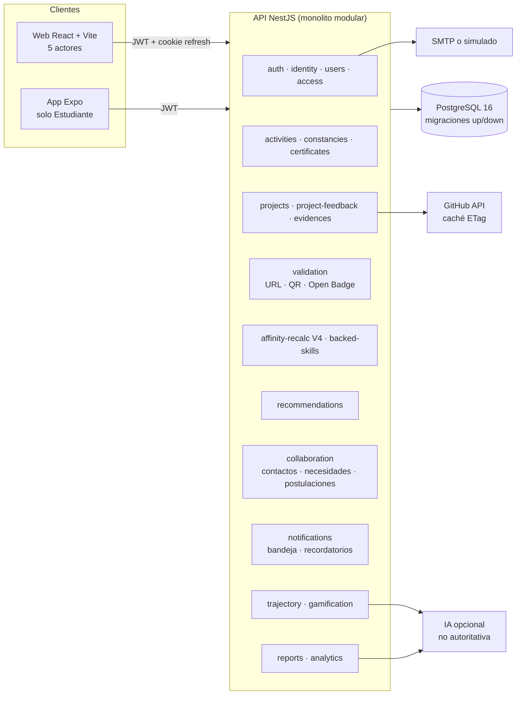
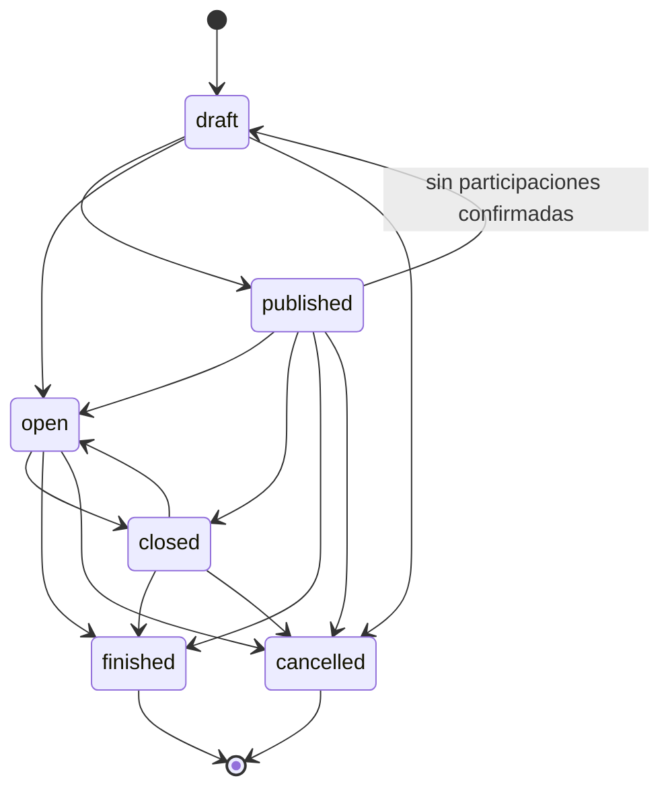
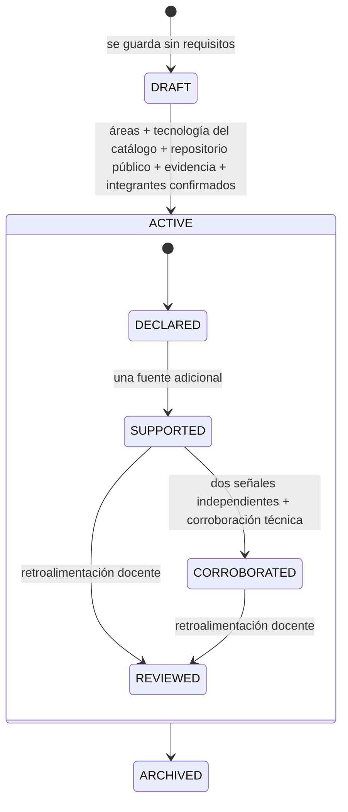
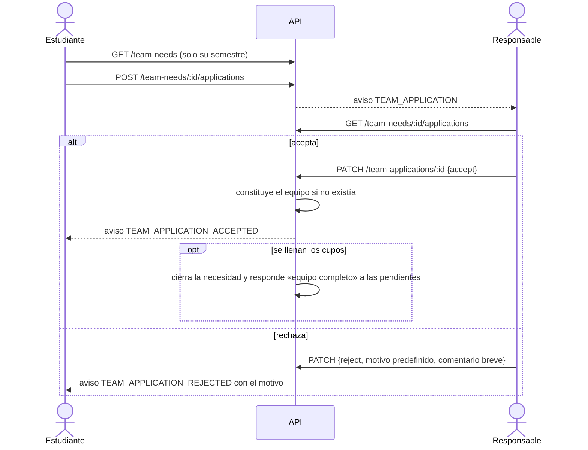
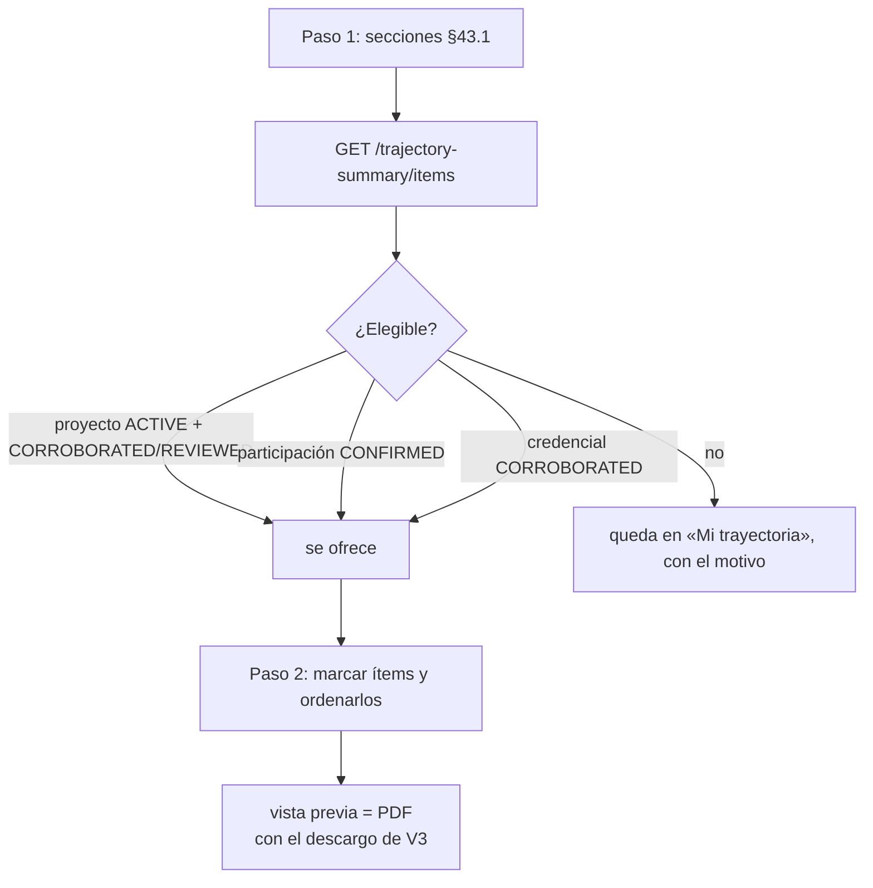
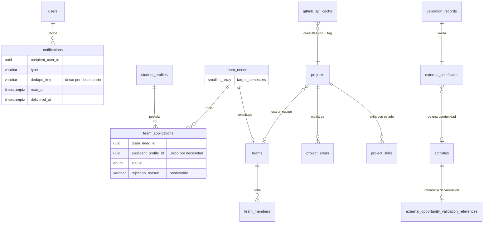

# Afinia V3 — Diagramas

Diagramas en Mermaid (los renderizan GitHub, VS Code y la mayoría de los visores de Markdown). Describen el sistema tal como está en el código al cerrar la V3.1.

## 1. Arquitectura

## 2. Estados de una actividad

Las propuestas de Docente y Sociedad pasan además por la revisión de Dirección (`pending → approved | observed | rejected`) antes de publicarse. Las 36 combinaciones de estado están probadas en UNIT.

## 3. Proyecto: de borrador a revisado

Solo `CORROBORATED` y `REVIEWED` suman a la afinidad y pueden ir al currículo verificado. Un borrador no suma ni da puntos.

## 4. Postulación a una necesidad de equipo

## 5. Currículo en dos niveles

## 6. Modelo de datos agregado en V3 (resumen)

Migraciones de la especificación V3 (14): de `1780470000000-V3AcademicScopeAndTeacherImport` a `1780590000000-V3TeamApplications` (más `1780390100000-V3AffinityWeights`, del motor V3 de la V2), todas con `up` y `down`.
