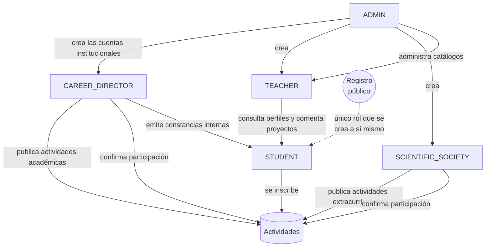
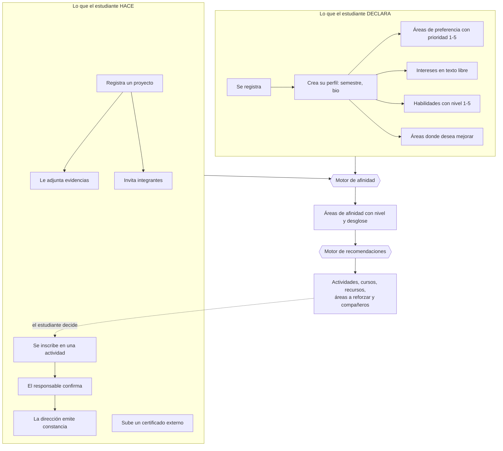
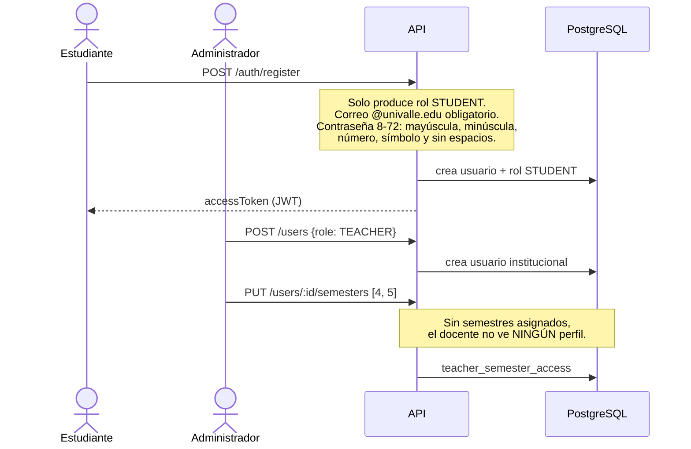
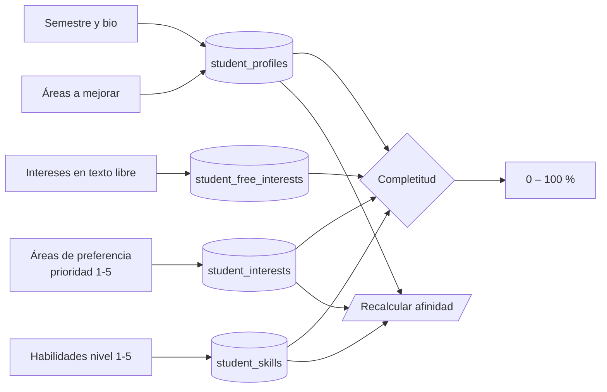
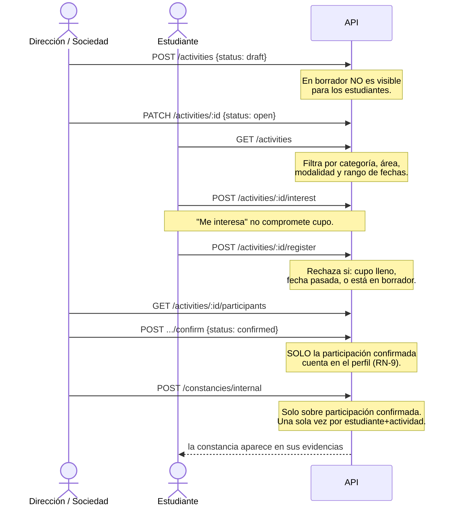
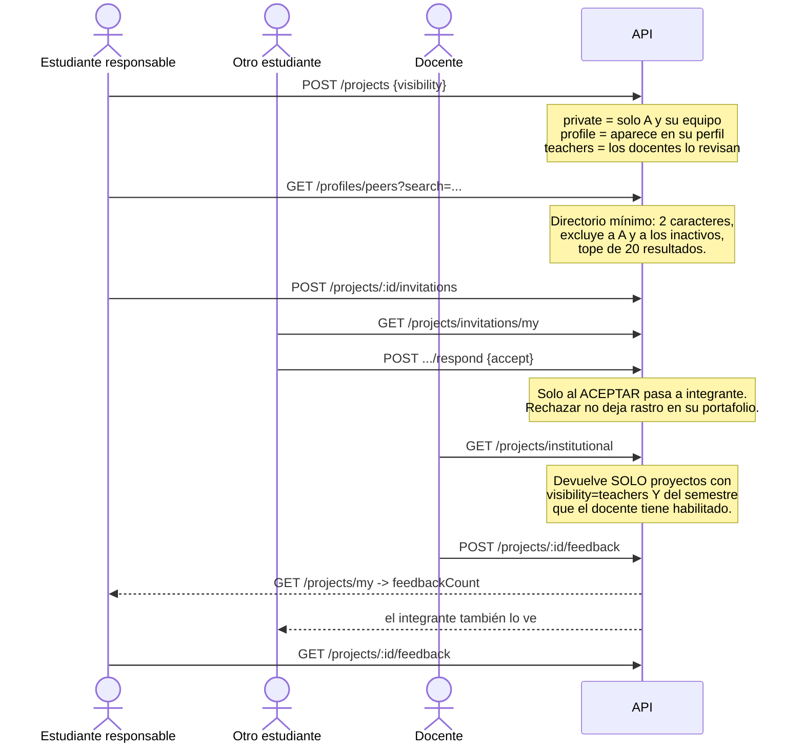
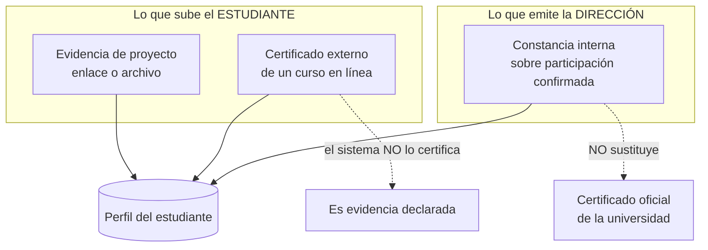
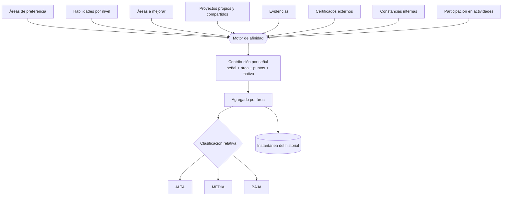
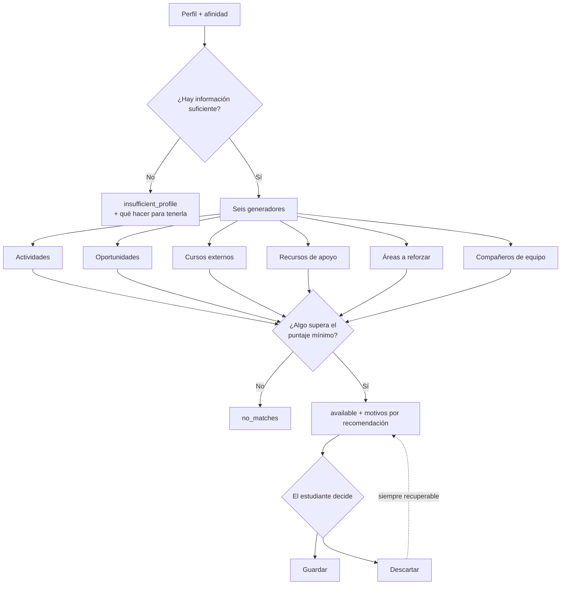
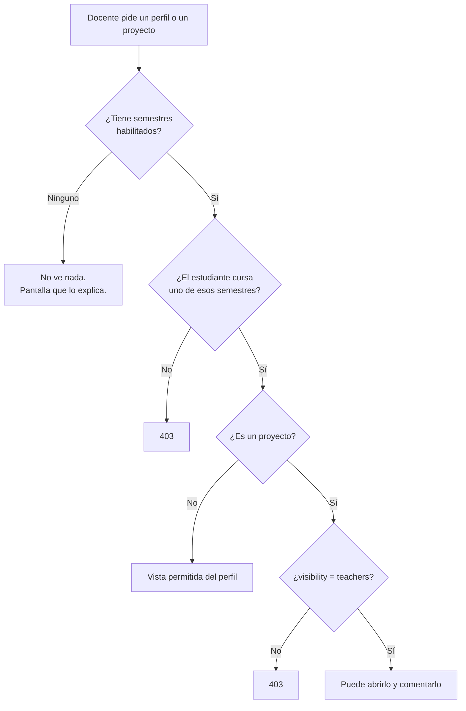

# Afinia · El sistema completo

**Sistema Multiplataforma para la Construcción del Perfil Estudiantil Dinámico
en Ingeniería en Sistemas Informáticos**
Universidad Privada del Valle · Cochabamba, Bolivia

Este documento explica **todo lo que el sistema hace y cómo lo hace**. Está
pensado para leerse de principio a fin sin necesidad de abrir el código: los
flujos están dibujados, las reglas están explicadas y cada afirmación se puede
verificar con los comandos del final.

---

## Índice

1. [Qué problema resuelve](#1-qué-problema-resuelve)
2. [Estado del proyecto](#2-estado-del-proyecto)
3. [Cómo está construido](#3-cómo-está-construido)
4. [Los cinco roles](#4-los-cinco-roles)
5. [El modelo de datos](#5-el-modelo-de-datos)
6. [Los flujos](#6-los-flujos) ← **el corazón de este documento**
7. [El motor de afinidad, por dentro](#7-el-motor-de-afinidad-por-dentro)
8. [El motor de recomendaciones, por dentro](#8-el-motor-de-recomendaciones-por-dentro)
9. [Control de acceso](#9-control-de-acceso)
10. [Cómo levantarlo](#10-cómo-levantarlo)
11. [Cómo se verifica](#11-cómo-se-verifica)
12. [Lo que el sistema NO hace](#12-lo-que-el-sistema-no-hace)

---

## 1. Qué problema resuelve

En la carrera de Ingeniería en Sistemas, lo que un estudiante realmente sabe
hacer queda disperso: un proyecto en un repositorio, un taller al que asistió,
un certificado de un curso en línea, una habilidad que nunca declaró en ningún
lado. Ni el estudiante ni sus docentes tienen una vista de conjunto.

**Afinia construye esa vista y la mantiene viva.** No es un currículum que el
estudiante escribe una vez: es un perfil que **se actualiza solo** a medida que
el estudiante participa en actividades, registra proyectos y suma evidencias.
De ahí sale su **afinidad** —las áreas de la carrera con las que su trayectoria
más se relaciona— y de ahí salen **recomendaciones** de qué hacer después.

Dos aclaraciones que el sistema repite en pantalla, porque importan:

> La afinidad es **orientación descriptiva**, no una nota ni una evaluación
> académica, y **no predice** rendimiento.
>
> Las recomendaciones son **sugerencias**, nunca obligaciones: el estudiante
> conserva la decisión sobre su utilización.

---

## 2. Estado del proyecto

Siete de los diez objetivos específicos están terminados y verificados.

| # | Objetivo | Requerimientos | Verificaciones | Estado |
|---|---|---|---|---|
| 1 | Usuarios, autenticación, roles y acceso | RF1 – RF4 | 63 | ✅ |
| 2 | Perfil estudiantil dinámico | RF5, RF6 | 59 | ✅ |
| 3 | Actividades académicas y extracurriculares | RF7 – RF9 | 47 | ✅ |
| 4 | Participación, evidencias y constancias | RF10 – RF12 | 66 | ✅ |
| 5 | Portafolio de proyectos estudiantiles | RF13 – RF16 | 112 | ✅ |
| 6 | Motor de afinidad estudiantil | RF17 | 82 | ✅ |
| 7 | Recomendaciones académicas ligeras | RF18 | 84 | ✅ |
| 8–10 | — | — | — | pendientes |

**513 verificaciones automatizadas, 0 fallos.**

---

## 3. Cómo está construido

Un monorepo con cuatro piezas. `shared` y `api` son un espacio de trabajo de
npm; `web` y `mobile` se instalan por separado.

```
afinia/
├── shared/    Tipos y enumeraciones que comparten los tres clientes
├── api/       NestJS 10 + TypeORM + PostgreSQL 16     -> puerto 3010
├── web/       React 18 + Vite 5                        -> puerto 5173
├── mobile/    React Native 0.81 + Expo 54
├── scripts/   Suites de verificación de punta a punta
└── docs/      Esta documentación
```

| Capa | Tecnología | Por qué |
|---|---|---|
| Base de datos | PostgreSQL 16 en Docker | 26 tablas, tipos enumerados nativos, consultas agregadas |
| API | NestJS 10 + TypeORM 0.3 | 106 endpoints, 16 controladores, módulos por dominio |
| Esquema | **Solo migraciones** (`synchronize: false`) | 12 migraciones, todas con `up` y `down` |
| Autenticación | JWT + Passport | guardas globales: `JwtAuthGuard` → `RolesGuard` |
| Validación | `ValidationPipe` global | `whitelist`, `forbidNonWhitelisted`, `transform` |
| Documentación viva | Swagger | `http://localhost:3010/api/docs` |
| Panel web | React + React Router + Recharts + framer-motion | 5 paneles, uno por rol |
| App móvil | React Native + Expo + React Navigation | el medio del estudiante |

**Dos puertos de salida (ports & adapters)** aíslan lo que podría cambiar:

- `AFFINITY_RECALCULATION` — cualquier módulo pide «recalcula la afinidad de
  este perfil» sin conocer el motor.
- `STORAGE_PORT` + `LocalStorageDriver` — los archivos se guardan en disco hoy;
  mañana en otro sitio sin tocar quien los sube.

---

## 4. Los cinco roles



| Rol | Qué puede hacer | Qué NO puede hacer |
|---|---|---|
| **STUDENT** | Registrarse solo, construir su perfil, inscribirse en actividades, registrar proyectos y evidencias, invitar integrantes, ver su afinidad y sus recomendaciones | Ver el perfil de otro estudiante, confirmar su propia participación |
| **TEACHER** | Consultar el perfil permitido de los estudiantes **de los semestres que el administrador le habilitó**, abrir proyectos marcados como visibles a docentes y dejar retroalimentación | Ver estudiantes fuera de su alcance, publicar actividades, emitir constancias |
| **CAREER_DIRECTOR** | Publicar actividades **académicas**, registrar asistencia, **emitir constancias internas**, ver indicadores agregados de la carrera | Escribir retroalimentación sobre proyectos |
| **SCIENTIFIC_SOCIETY** | Publicar actividades **extracurriculares** y confirmar participación | Emitir constancias, publicar actividades académicas |
| **ADMIN** | Crear usuarios institucionales, asignar semestres a docentes, administrar áreas, habilidades, categorías y criterios de gamificación | — |

> **El estudiante es el único que se registra por su cuenta.** El resto de
> cuentas las crea el administrador. Esto no es una decisión de interfaz: el
> endpoint `POST /auth/register` solo produce estudiantes, y exige un correo
> del dominio `univalle.edu`.

---

## 5. El modelo de datos

26 tablas, creadas por 12 migraciones. Agrupadas por lo que representan:

| Grupo | Tablas |
|---|---|
| **Identidad y acceso** | `users`, `roles`, `teacher_semester_access` |
| **Perfil del estudiante** | `student_profiles`, `student_interests`, `student_free_interests`, `student_skills` |
| **Catálogos administrables** | `academic_areas`, `skills`, `activity_categories`, `gamification_criteria` |
| **Actividades** | `activities`, `activity_registrations` |
| **Evidencias** | `project_evidences`, `external_certificates`, `internal_constancies` |
| **Portafolio** | `projects`, `project_members`, `project_invitations`, `project_feedback` |
| **Afinidad** | `affinity_results`, `affinity_weights`, `affinity_contributions`, `affinity_snapshots`, `affinity_snapshot_items` |
| **Recomendaciones** | `recommendations` |

Dos distinciones del modelo que suelen confundirse:

- **`student_interests` vs `student_free_interests`.** Las primeras son áreas
  del catálogo con una prioridad de 1 a 5 («áreas de preferencia»). Las
  segundas son texto libre que el estudiante escribe con sus palabras. El
  documento de grado las enumera como datos declarativos **distintos**, y así
  están modeladas.
- **`external_certificates` vs `internal_constancies`.** El certificado externo
  lo sube el estudiante y **el sistema no lo certifica**: es evidencia
  declarada. La constancia interna la **emite la dirección de carrera** sobre
  participación confirmada, una sola vez por estudiante y actividad, y aun así
  no sustituye a un certificado oficial de la universidad.

---

## 6. Los flujos

### 6.0 El recorrido completo, de un vistazo

Así se construye un perfil desde cero hasta que el sistema puede orientar:



El bucle se cierra: lo que el estudiante hace alimenta su afinidad, la afinidad
alimenta las recomendaciones, y las recomendaciones le sugieren qué hacer
después.

---

### 6.1 Alta y acceso



Cada petición posterior pasa por dos guardas globales, en este orden:

```
petición → JwtAuthGuard (¿el token es válido?) → RolesGuard (¿el rol alcanza?) → controlador
```

Si un usuario se desactiva, pierde el acceso de inmediato aunque su sesión siga
abierta.

---

### 6.2 El perfil dinámico



La **completitud** se calcula sobre cinco piezas: semestre, descripción,
intereses, habilidades y áreas de mejora. Cada cambio en el perfil dispara una
recalculación de afinidad a través del puerto `AFFINITY_RECALCULATION`.

> **Nota sobre las habilidades.** Se declaran desde el **panel web**
> («Intereses y habilidades»). El registro de habilidades se retiró de la
> aplicación móvil a pedido del usuario; el dato sigue existiendo y sigue
> alimentando la afinidad exactamente igual.

---

### 6.3 Actividades: del anuncio a la constancia

Este es el flujo con más reglas de negocio del sistema.



Los cuatro estados de la participación de un estudiante:

| Estado | Qué significa | ¿Suma al perfil? |
|---|---|---|
| `interested` | Marcó interés | No, pero sí a la afinidad (1 punto) |
| `registered` | Se inscribió, falta que el responsable registre | Sí, parcialmente (2 puntos) |
| `confirmed` | El responsable confirmó su asistencia | **Sí (3 puntos)** |
| `absent` | El responsable lo registró como ausente | No |

**Quién publica qué** no es negociable: la dirección de carrera publica las
académicas, la sociedad científica las extracurriculares. El docente solo las
consulta, para orientar a sus estudiantes.

---

### 6.4 Portafolio: proyecto, equipo y retroalimentación



Las tres visibilidades de un proyecto son la única puerta: un proyecto en
`private` o `profile` **no aparece** en el portafolio institucional, por mucho
que el docente tenga el semestre habilitado.

> **Corrección registrada.** La API siempre devolvió la retroalimentación al
> estudiante vinculado, pero ninguna pantalla se la mostraba en el panel web, y
> en el móvil no había forma de saber que existía sin abrir cada proyecto. Hoy
> `GET /projects/my` devuelve `feedbackCount` y ambas interfaces lo anuncian.

---

### 6.5 Evidencias

Tres cosas distintas que conviven y no deben confundirse:



Los archivos aceptan PDF, PNG, JPG y WEBP, con un máximo de 5 MB, a través del
`STORAGE_PORT`.

---

### 6.6 Afinidad: de las señales al nivel



Cada cálculo guarda **por qué**: el estudiante puede abrir un área y ver qué
señal aportó cuántos puntos. Sin eso, el número no se puede defender en una
conversación con su docente.

---

### 6.7 Recomendaciones



Las **tres salidas** son distintas a propósito. «Todavía no podemos
recomendarte porque tu perfil está vacío» y «tu perfil está completo pero hoy
no hay nada que encaje» son problemas diferentes y merecen mensajes diferentes.

---

### 6.8 Alcance del docente: la regla que más se prueba



`TeacherScopeService` es la **única fuente de verdad** de esta regla en todo el
sistema. Se aplica en el backend, siempre: cambiar un identificador en la URL
no salta el control. Ocultar un botón en la interfaz nunca fue autorización.

La «vista permitida» del perfil incluye intereses, habilidades, proyectos,
actividades, certificados y afinidad. **No incluye** notas, datos sensibles ni
las constancias internas.

---

## 7. El motor de afinidad, por dentro

### Las 13 ponderaciones

Están **en la base de datos**, no en el código, y se consultan desde la
interfaz: el estudiante puede ver con qué reglas se le calculó.

| Señal | Puntos |
|---|---|
| Proyecto propio | 5 |
| Proyecto como integrante | 5 |
| Certificado externo | 4 |
| Participación confirmada | 3 |
| Constancia interna | 3 |
| Habilidad de nivel avanzado | 3 |
| Inscripción en una actividad | 2 |
| Habilidad de nivel intermedio | 2 |
| Interés declarado | 2 |
| Evidencia académica | 2 |
| Área en la que desea mejorar | 1 |
| Habilidad de nivel básico | 1 |
| Interés en una actividad | 1 |

El motor lee estos valores de `affinity_weights` y cae a valores por defecto si
la tabla estuviera vacía, para que nunca deje de funcionar.

### Por qué la clasificación es relativa

Un nivel «alto» con umbrales absolutos resultaba inútil: medido sobre los datos
sembrados, **13 de 28 estudiantes no tenían ninguna área alta**. Un estudiante
de segundo semestre nunca alcanzaría el umbral de uno de octavo, y el nivel
dejaba de decir nada sobre él.

La clasificación combina **proporción respecto al área más fuerte del propio
estudiante** con un **piso absoluto**:

```
ALTA   = puntaje ≥ 60 % del área más fuerte  Y  puntaje ≥ 6
MEDIA  = puntaje ≥ 30 % del área más fuerte  Y  puntaje ≥ 3
BAJA   = el resto
```

El piso absoluto evita el problema opuesto: sin él, un estudiante con una sola
señal de 1 punto tendría un área «alta». Con la regla relativa, los estudiantes
sin ningún área alta bajaron de 13 a 5 — y esos 5 tienen perfiles genuinamente
vacíos.

### Lo que se guarda de cada cálculo

- **`affinity_results`** — el puntaje y el nivel vigentes por área.
- **`affinity_contributions`** — cada señal que aportó, con su motivo. Es lo
  que hace el resultado explicable.
- **`affinity_snapshots` / `_items`** — el historial. Se conservan las **30**
  más recientes; las anteriores se podan en el mismo cálculo.

Todo el guardado ocurre **en una transacción**: antes no lo era, y un fallo a
mitad de camino dejaba a un estudiante sin ninguna afinidad.

---

## 8. El motor de recomendaciones, por dentro

Seis generadores, cada uno con su regla:

| Generador | Qué sugiere | Señales que usa |
|---|---|---|
| **Actividades** | Actividades abiertas que encajan | área de afinidad, área de preferencia, coincidencia con interés libre, fecha próxima |
| **Oportunidades** | Convocatorias y concursos | las mismas |
| **Cursos externos** | Formación complementaria | área de mejora, habilidad declarada |
| **Recursos de apoyo** | Material de la categoría «recurso de apoyo» | área de mejora |
| **Áreas a reforzar** | Dónde conviene poner esfuerzo | área de mejora declarada, afinidad baja o ausente |
| **Compañeros** | Con quién formar equipo | afinidad compartida, perfil complementario |

Puntajes principales: área de afinidad **6 / 4 / 2** según nivel; área de
mejora **4**; coincidencia con interés libre **3**; coincidencia con habilidad
**2**; fecha próxima **+1** dentro de 30 días. El mínimo para recomendar algo
es **2 puntos**, y la fecha próxima **nunca alcanza por sí sola**.

Lo que el motor **excluye** siempre: actividades en las que el estudiante ya
está inscrito, actividades pasadas, actividades con el cupo lleno y actividades
en borrador.

**Privacidad de la recomendación de compañeros.** Un estudiante solo puede ser
sugerido como compañero si su perfil es descubrible
(`student_profiles.peer_discoverable`). La sugerencia muestra una tarjeta
mínima; no abre el perfil de nadie.

**Versión de reglas.** Cada recomendación guarda un `rulesVersion` —un hash de
16 caracteres de las reglas vigentes—, de modo que siempre se sabe con qué
criterio se generó.

---

## 9. Control de acceso

El sistema aplica cuatro capas, todas en el servidor:

```
1. JwtAuthGuard    ¿el token es válido y la cuenta sigue activa?
2. RolesGuard      ¿el rol tiene permitido este endpoint?
3. Regla de dominio  ¿este usuario concreto puede tocar este recurso concreto?
4. ValidationPipe  ¿el cuerpo trae exactamente los campos esperados?
```

La capa 3 es la que más trabajo hace, y es la que nunca se delega a la
interfaz. Ejemplos verificados:

| Intento | Resultado |
|---|---|
| Docente cambia el ID en la URL para ver un estudiante de otro semestre | **403** |
| Docente comenta un proyecto marcado como privado | **403** |
| Estudiante lee la retroalimentación de un proyecto ajeno | **403** |
| Estudiante confirma su propia participación | **403** |
| Director escribe retroalimentación docente | **403** |
| Estudiante desactiva a otro usuario | **403** |

El `ValidationPipe` global usa `forbidNonWhitelisted`: un campo de más en el
cuerpo de la petición no se ignora, se rechaza.

---

## 10. Cómo levantarlo

```bash
# 1. Dependencias (una vez)
npm install
npm install --prefix web
npm install --prefix mobile

# 2. Base de datos
npm run db:up            # PostgreSQL 16 en Docker
npm run api:migrate      # crea las 26 tablas
npm run seed:populate    # datos de ejemplo

# 3. Los tres procesos
npm run api:dev          # http://localhost:3010/api  · Swagger en /api/docs
npm run web:dev          # http://localhost:5173
cd mobile && npx expo start
```

**El puerto de la API es el 3010**, configurado en `.env` como `API_PORT`. Las
suites de verificación lo esperan en `API_URL`.

---

## 11. Cómo se verifica

Las pruebas no son unitarias: son **suites de punta a punta contra la API en
ejecución**, que recorren el sistema como lo haría una persona. Comprueban
tanto que lo permitido funciona como que **lo prohibido devuelve 403**.

```bash
export API_URL=http://localhost:3010/api
npm run test:40    # objetivos 1 a 4   -> 235 verificaciones
npm run test:50    # objetivo 5        -> 112 verificaciones
npm run test:60    # objetivo 6        -> 82 verificaciones
npm run test:70    # objetivo 7        -> 84 verificaciones
```

**513 verificaciones, 0 fallos.**

Además, compilación limpia de las tres partes:

```bash
cd api    && npx tsc --noEmit
cd web    && npm run build
cd mobile && npx tsc --noEmit
```

---

## 12. Lo que el sistema NO hace

Ser explícito aquí vale más que prometer de menos.

**No es aprendizaje automático.** La afinidad es un sistema de reglas con
ponderaciones configurables y trazabilidad completa: cada punto tiene un motivo
que se puede leer. No hay modelo entrenado, no hay predicción, no hay caja
negra. Eso es una **elección**, no una limitación: en un sistema que orienta
decisiones académicas, un número que nadie puede justificar no sirve.

**Fuera del alcance de los siete objetivos terminados:**

- Chat y contactos por QR
- Gestión avanzada de equipos
- Gamificación completa — los criterios ya se administran, pero el motor que
  los aplica pertenece a una fase posterior: **todavía no se generan puntos ni
  insignias**
- Analítica avanzada y predicción de rendimiento
- Certificados oficiales de la universidad
- Integración real con SIU y Microsoft Teams

**Contradicciones detectadas en el documento de grado**, registradas sin
corregirlas por cuenta propia:

- Las Figuras 2.29 y 2.30 colocan el camino de éxito dentro de la rama `alt`
  rotulada como «datos insuficientes».
- La Figura 2.12 contradice a la Tabla 2.23.
- Las Figuras 2.3 y 2.11 contienen elementos sin ningún RF que los respalde.

---

## Documentación relacionada

| Documento | Contenido |
|---|---|
| [`MATRIZ_TRAZABILIDAD_70.md`](MATRIZ_TRAZABILIDAD_70.md) | RF1 a RF18, requisito por requisito |
| [`AUDITORIA_FINAL_70_PORCIENTO.md`](AUDITORIA_FINAL_70_PORCIENTO.md) | Auditoría de cierre de los siete objetivos |
| [`DEMO_70_PORCIENTO.md`](DEMO_70_PORCIENTO.md) | Guion de demostración de 9–11 minutos |
| [`MEJORAS_UX.md`](MEJORAS_UX.md) | El trabajo de interfaz y su verificación |
| [`CHECKLIST-DEFENSA.md`](CHECKLIST-DEFENSA.md) | Repaso previo a la defensa |
