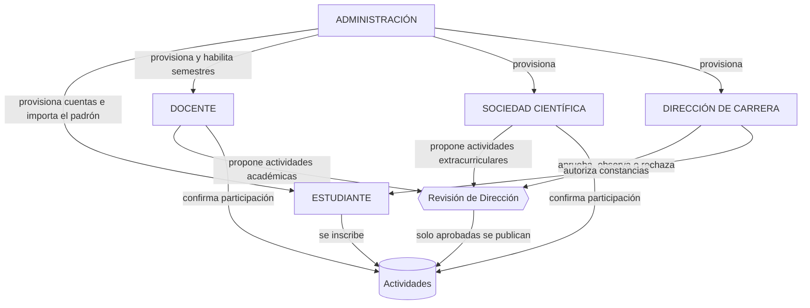
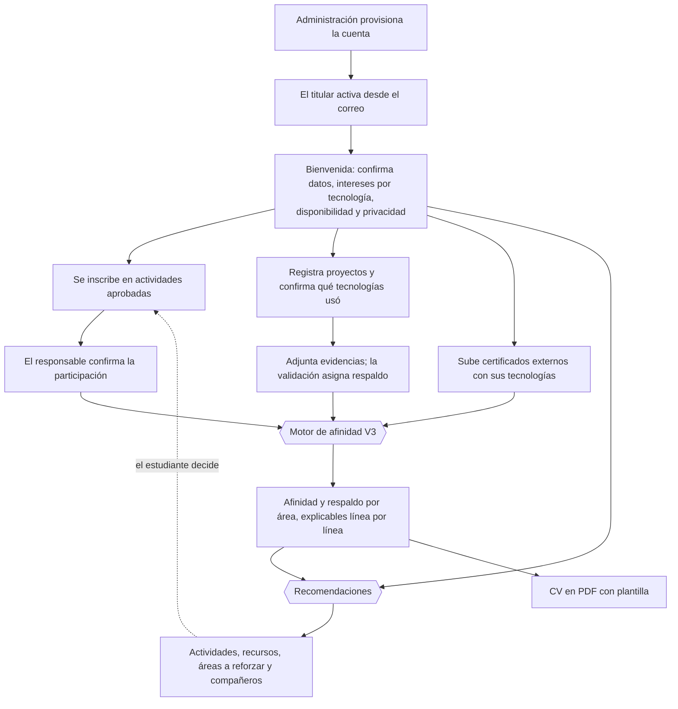
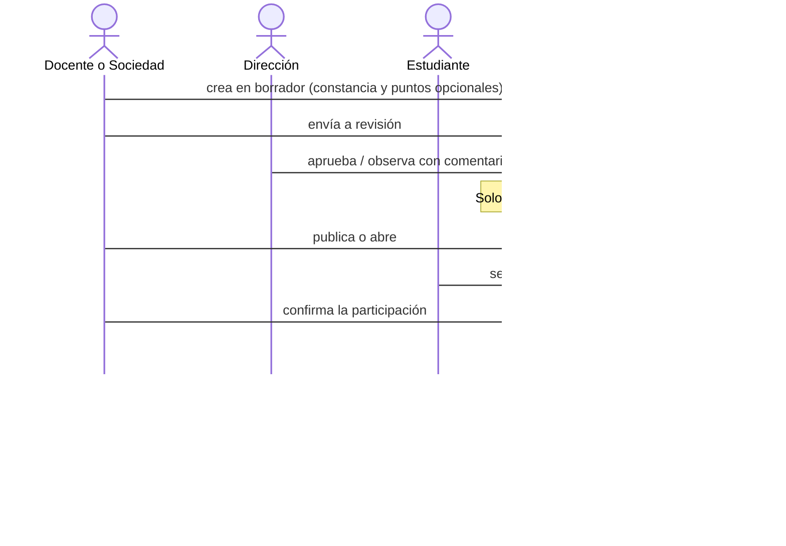

# Afinia · El sistema completo (V2)

**Sistema Multiplataforma para la Construcción del Perfil Estudiantil Dinámico
en Ingeniería en Sistemas Informáticos**
Universidad Privada del Valle · Cochabamba, Bolivia

Este documento explica **todo lo que el sistema hace hoy y cómo lo hace**,
según la *Especificación Maestra Final V2*. Está pensado para leerse de
principio a fin sin abrir el código: los flujos están dibujados, las reglas
están explicadas y cada afirmación se puede verificar con las pruebas del final.

> Versiones anteriores de este documento describían funciones que la V2 retiró
> (registro público, nivel de habilidad autodeclarado, afinidad relativa,
> chat). Este texto reemplaza aquel: si algo no figura aquí, el sistema no lo
> hace.

---

## Índice

1. [Qué problema resuelve](#1-qué-problema-resuelve)
2. [Estado](#2-estado)
3. [Cómo está construido](#3-cómo-está-construido)
4. [Los cinco roles](#4-los-cinco-roles)
5. [El modelo de datos](#5-el-modelo-de-datos)
6. [Los flujos](#6-los-flujos)
7. [El motor de afinidad V3, por dentro](#7-el-motor-de-afinidad-v3-por-dentro)
8. [El motor de recomendaciones, por dentro](#8-el-motor-de-recomendaciones-por-dentro)
9. [El asistente de IA](#9-el-asistente-de-ia)
10. [Control de acceso y privacidad](#10-control-de-acceso-y-privacidad)
11. [Cómo levantarlo](#11-cómo-levantarlo)
12. [Cómo se verifica](#12-cómo-se-verifica)
13. [Lo que el sistema NO hace](#13-lo-que-el-sistema-no-hace)

---

## 1. Qué problema resuelve

En la carrera, lo que un estudiante realmente hizo queda disperso: un proyecto
en un repositorio, un taller al que asistió, un certificado de un curso en
línea. Ni el estudiante ni sus docentes tienen una vista de conjunto.

**Afinia construye esa vista a partir de lo que el estudiante hizo y está
respaldado**, no de lo que declara. De ahí sale su **afinidad** —las áreas de la
carrera con las que su trayectoria se relaciona—, su **respaldo** —cuánto de eso
está demostrado— y **recomendaciones** de qué hacer después.

> La afinidad es **orientación descriptiva**: no es una nota, no evalúa a nadie
> y no predice rendimiento. Las recomendaciones son sugerencias: decide el
> estudiante.

---

## 2. Estado

Los 25 requisitos funcionales y los 10 no funcionales de la V2 están
implementados y verificados. La trazabilidad punto por punto está en
[`MATRIZ_TRAZABILIDAD_V2.md`](MATRIZ_TRAZABILIDAD_V2.md); lo que se hizo en cada
batch, con sus pruebas y resultados, en
[`V2_REPORTE_BATCHES.md`](V2_REPORTE_BATCHES.md); la revisión de seguridad,
rendimiento y calidad, en [`SEGURIDAD_V2.md`](SEGURIDAD_V2.md).

---

## 3. Cómo está construido

Un monolito modular con tres clientes de una misma API.

```
afinia/
├── shared/    Tipos, enumeraciones y escalas que comparten API, web y móvil
├── api/       NestJS 10 + TypeORM 0.3 + PostgreSQL 16    -> puerto 3010
├── web/       React 18 + Vite                             -> puerto 5173
├── mobile/    React Native 0.81 + Expo SDK 54 (solo Estudiante)
├── scripts/   Suites de verificación, k6 y ZAP
└── docs/      Esta documentación
```

| Pieza | Cifra |
|---|---|
| Tablas | 68 |
| Migraciones (todas con `up` y `down`) | 36 |
| Rutas HTTP | 228, en 28 controladores y 33 módulos |
| Pantallas | 42 en la web, 15 en el móvil |

Decisiones que sostienen el resto:

- **Solo migraciones** (`synchronize: false`): el esquema cambia por código revisable y reversible.
- **Validación global** (`whitelist`, `forbidNonWhitelisted`): una propiedad no declarada en el DTO se rechaza.
- **Puertos y adaptadores** donde algo puede cambiar: recálculo de trayectoria, almacenamiento de archivos y **asistente de IA** (`none` u `openai_compatible`).
- **Colas persistentes** en la base para el correo y la validación: un reinicio no pierde trabajo.

---

## 4. Los cinco roles


```mermaid
flowchart TD
    A[ADMINISTRACIÓN] -->|provisiona cuentas e importa el padrón| E[ESTUDIANTE]
    A -->|provisiona y habilita semestres| C[DOCENTE]
    A -->|provisiona| D[SOCIEDAD CIENTÍFICA]
    A -->|provisiona| B[DIRECCIÓN DE CARRERA]
    C -->|propone actividades académicas| R{{Revisión de Dirección}}
    D -->|propone actividades extracurriculares| R
    B -->|aprueba, observa o rechaza| R
    R -->|solo aprobadas se publican| F[(Actividades)]
    E -->|se inscribe| F
    C -->|confirma participación| F
    D -->|confirma participación| F
    B -->|autoriza constancias| E
```

| Rol | Puede | No puede |
|---|---|---|
| **Estudiante** (web y móvil) | Completar la bienvenida, declarar intereses por tecnología, inscribirse, registrar proyectos y evidencias, ver su afinidad y respaldo, recibir recomendaciones, compartir su perfil, gestionar contactos y equipos, descargar su CV | Ver el perfil de otro sin su permiso, confirmar su propia participación, cambiar su semestre o código |
| **Docente** (web) | Proponer actividades, consultar estudiantes y proyectos **de sus semestres habilitados**, ver su Panel académico y las necesidades de equipo de su alcance | Publicar sin aprobación, ver fuera de su alcance |
| **Dirección** (web) | Aprobar actividades, publicar las propias, autorizar constancias, ver analítica descriptiva | Ver detalles individuales fuera de lo que la analítica agrega |
| **Sociedad científica** (web) | Proponer actividades extracurriculares, confirmar participación, ver métricas de sus actividades | Ver datos de actividades ajenas |
| **Administración** (web) | Cuentas, padrón, roles y estados, alcance docente, catálogos, recursos, criterios de puntos, auditoría | Otorgar constancias, ver contraseñas o códigos |

**No hay registro público.** Toda cuenta la provisiona la institución y la
activa su titular desde el correo. **La app móvil es del Estudiante**: la API no
emite sesión a otro rol desde el móvil.

---

## 5. El modelo de datos

| Grupo | Tablas principales |
|---|---|
| Identidad | `users`, `roles`, `auth_sessions`, `account_tokens`, `mail_jobs`, `teacher_semester_access` |
| Perfil | `student_profiles`, `student_interests`, `student_skill_interests`, `student_contact_channels` |
| Catálogos | `academic_areas`, `skills` (con `aliases`), `activity_categories`, `learning_resources`, `gamification_criteria` |
| Actividades | `activities` (con estado de revisión), `activity_reviews`, `activity_gamification_rules`, `activity_registrations`, `activity_skills` |
| Evidencias | `project_evidences`, `external_certificates`, `external_certificate_skills`, `internal_constancies`, `stored_files`, `validation_records` |
| Proyectos | `projects`, `project_members` (el responsable es integrante), `project_member_skills`, `project_feedback`, `project_events` |
| Afinidad | `affinity_results`, `affinity_contributions`, `affinity_snapshots`, `affinity_snapshot_items`, `affinity_weights` |
| Recomendaciones | `recommendations` |
| Colaboración | `contacts`, `contact_requests`, `contact_notes`, `team_needs`, `teams`, `team_members`, `team_invitations` |
| Gamificación | `gamification_events`, `student_points`, `badges`, `student_badges` |
| IA y auditoría | `ai_assistance_runs`, `audit_events` |

Las tablas del chat (`conversations`, `messages`) se conservan como historia,
sin acceso funcional y con un comentario en la base que lo explica.

---

## 6. Los flujos

### 6.0 El recorrido completo


```mermaid
flowchart TD
    P[Administración provisiona la cuenta] --> A[El titular activa desde el correo]
    A --> W[Bienvenida: confirma datos, intereses por tecnología,<br/>disponibilidad y privacidad]
    W --> H1[Se inscribe en actividades aprobadas]
    H1 --> H2[El responsable confirma la participación]
    W --> H3[Registra proyectos y confirma qué tecnologías usó]
    H3 --> H4[Adjunta evidencias; la validación asigna respaldo]
    W --> H5[Sube certificados externos con sus tecnologías]
    H2 --> M{{Motor de afinidad V3}}
    H4 --> M
    H5 --> M
    M --> R[Afinidad y respaldo por área, explicables línea por línea]
    R --> REC{{Recomendaciones}}
    W --> REC
    REC --> S[Actividades, recursos, áreas a reforzar y compañeros]
    S -.->|el estudiante decide| H1
    R --> CV[CV en PDF con plantilla]
```

Lo declarado (intereses) **orienta** las recomendaciones; lo hecho y respaldado
**construye** la afinidad.

### 6.1 Alta y acceso

```mermaid
sequenceDiagram
    actor A as Administración
    actor E as Titular
    participant API
    participant Cola as Cola de correo
    A->>API: POST /users (código universitario del rol; semestre si corresponde)
    API->>Cola: activación (enlace + código, vigencia 48 h)
    Cola-->>E: correo institucional
    E->>API: POST /activation/activate (elige su contraseña)
    E->>API: POST /auth/login
    API-->>E: access token corto + refresh rotatorio (cookie HttpOnly en la web)
```

La contraseña sigue la misma política en servidor y pantallas (12–128
caracteres, cuatro clases, sin el correo ni el código). El reenvío tiene espera
de 120 s y tope diario; la recuperación vence en 30 minutos.

### 6.2 La bienvenida

Cinco pasos y cuatro obligatorios que el servidor exige: confirmar datos
institucionales, declarar al menos un interés o tecnología a mejorar, decidir
la disponibilidad y revisar la privacidad. El cuestionario de orientación es
opcional. **No se declara nivel de habilidad**: se retiró en la V2.

### 6.3 Actividades: de la propuesta a la constancia


```mermaid
sequenceDiagram
    actor Doc as Docente o Sociedad
    actor Dir as Dirección
    actor E as Estudiante
    participant API
    Doc->>API: crea en borrador (constancia y puntos opcionales)
    Doc->>API: envía a revisión
    Dir->>API: aprueba / observa con comentario / rechaza
    Note over API: Solo aprobada se puede publicar (409 si no).
    Doc->>API: publica o abre
    E->>API: se inscribe
    Doc->>API: confirma la participación
    API->>API: recalcula afinidad, respaldo y puntos
    Doc->>API: emite constancia (si está habilitada)
    Note over API: Queda el emisor y la Dirección que autorizó.
```

### 6.4 Proyectos

El responsable es integrante desde el inicio. Cada integrante confirma su rol,
su contribución y **las tecnologías que usó** (`skills_used`); solo eso le
atribuye experiencia. El proyecto tiene un **nivel de respaldo**: `DECLARED`,
`SUPPORTED`, `CORROBORATED`, `REVIEWED` o `FLAGGED`, según sus evidencias, la
comprobación de su repositorio y su URL, y la retroalimentación docente.

### 6.5 Evidencias y validación

Los archivos se guardan privados y se descargan solo con sesión y permiso. Un
proceso asíncrono extrae lo que puede (texto del PDF, OCR, metadatos, QR),
compara el titular y asigna un respaldo. Afinia **no afirma autenticidad legal**;
dice qué pudo comprobar.

### 6.6 Colaboración sin chat

El perfil compartible es opcional, con un enlace opaco que se puede cambiar y un
QR que solo lleva ese enlace. Los contactos nacen de una solicitud que la otra
persona acepta. **No hay chat**: cada estudiante comparte, si quiere, sus
canales (Teams, WhatsApp, LinkedIn, correo de contacto u otro enlace) y anota a
sus contactos con un alias, un contexto y el canal preferido. Los equipos nacen
de una necesidad declarada; el sistema sugiere candidatos complementarios y
**invitar es siempre una decisión de una persona**. Los nombres de equipo se
moderan.

---

## 7. El motor de afinidad V3, por dentro

Por área, sumando solo lo respaldado:

| Familia | Puntos | Rendimiento decreciente | Tope |
|---|---|---|---|
| Actividad confirmada | 10 | 1 · 0,7 · 0,5 · 0,3 | 25 |
| Proyecto según respaldo | 0 / 10 / 18 / 22 / 0 (declarado / con respaldo / corroborado / revisado / marcado) | 1 · 0,75 · 0,5 · 0,25 | 50 |
| Certificado según respaldo | 0 / 8 / 15 | 1 · 0,75 · 0,5 · 0,25 | 25 |
| Intereses y preferencias | **0** | — | — |

`afinidad = round(min(100, actividades + proyectos + certificados))`. No se
compara contra el área más fuerte del propio estudiante. El proyecto suma en
las áreas de las tecnologías que **ese integrante** confirmó haber usado.

El **respaldo** es otro puntaje (topes 20 / 45 / 25 / 10 para actividades,
proyectos, certificados y otras señales). Los niveles son bajo (0–24), medio
(25–59) y alto (60–100). Cada puntaje se abre en un **desglose** que suma
exactamente el total y muestra también lo que se tuvo en cuenta y no sumó. Los
resultados de versiones anteriores del motor se conservan como historia.

---

## 8. El motor de recomendaciones, por dentro

Cada elemento recibe hasta 100 puntos, repartidos así:

| Señal | Peso |
|---|---|
| Interés explícito (área o tecnología) | 35 |
| Tecnología o área que quiere mejorar | 25 |
| Orientación confirmada | 20 |
| Afinidad y respaldo del área | 10 |
| Contexto (fecha, semestre, modalidad) | 10 |

Cada recomendación muestra sus motivos, y su puntaje es la suma de ellos. El
semestre es un filtro duro. Lo descartado no vuelve.

---

## 9. El asistente de IA

Opcional y no autoritativo. Con `AI_PROVIDER=none` todo funciona y las pantallas
no ofrecen la ayuda. Con un proveedor compatible con `/chat/completions` ayuda a:
sugerir etiquetas y el área de una tecnología nueva, resumir las evidencias de
un proyecto, explicar sus inconsistencias, mejorar la redacción del CV y narrar
tendencias. Las reglas actúan primero; cada respuesta se valida (un área que no
existe, o cifras que la fuente no tenía, invalidan la sugerencia); de la entrada
se guarda solo una huella; y **nada cambia hasta que una persona la acepta y la
guarda**. Nunca toca afinidad, respaldo, aprobaciones, participación ni
constancias.

---

## 10. Control de acceso y privacidad

```
petición → JwtAuthGuard → RolesGuard → regla del recurso en el servicio (propiedad, alcance) → respuesta mínima
```

- **Alcance docente**: una sola fuente (`TeacherScopeService`) para perfiles, proyectos, paneles y la IA.
- **Datos mínimos**: el hash de contraseña nunca sale; el estudiante recibe de las actividades solo lo que necesita; el correo institucional no se expone por omisión.
- **Analítica con umbral**: un grupo demasiado pequeño se muestra sin desglose.
- **Auditoría** de eventos relevantes, sin contraseñas, tokens ni códigos.

---

## 11. Cómo levantarlo

```bash
cp .env.example .env
npm install && npm install --prefix web && npm install --prefix mobile
npm run db:up && npm run db:wait
npm run shared:build && npm run api:migrate && npm run seed:populate
npm run api:dev        # http://localhost:3010/api  (Swagger en /api/docs si SWAGGER_ENABLED=true)
npm run web:dev        # http://localhost:5173
npm run mobile:start   # Expo
```

---

## 12. Cómo se verifica

| Comando | Qué prueba |
|---|---|
| `npm run test:unit` | Reglas puras (afinidad, recomendaciones, contraseña, moderación, canales, IA, PDF) |
| `npm run test:all` | Todas las suites contra la API real, la IA con proveedor simulado y el navegador |
| `npm run test:v2` | Los batches de la V2 |
| `npm run test:ai` | IA con proveedor `openai_compatible` simulado |
| `npm run test:web` | Web en Edge con Playwright |
| `node scripts/k6/run-k6.mjs` | Carga (RNF05) |
| `node scripts/zap/run-zap.mjs` | Escaneo de seguridad OWASP ZAP |

---

## 13. Lo que el sistema NO hace

- **No reemplaza** al SIU, a Teams ni a los certificados oficiales.
- **No evalúa ni predice**: no hay notas, ni rendimiento, ni abandono, ni éxito profesional.
- **No acredita competencias**: describe dónde aparece una tecnología en una trayectoria respaldada.
- **No tiene chat ni registro público.**
- **La IA no decide nada.**
